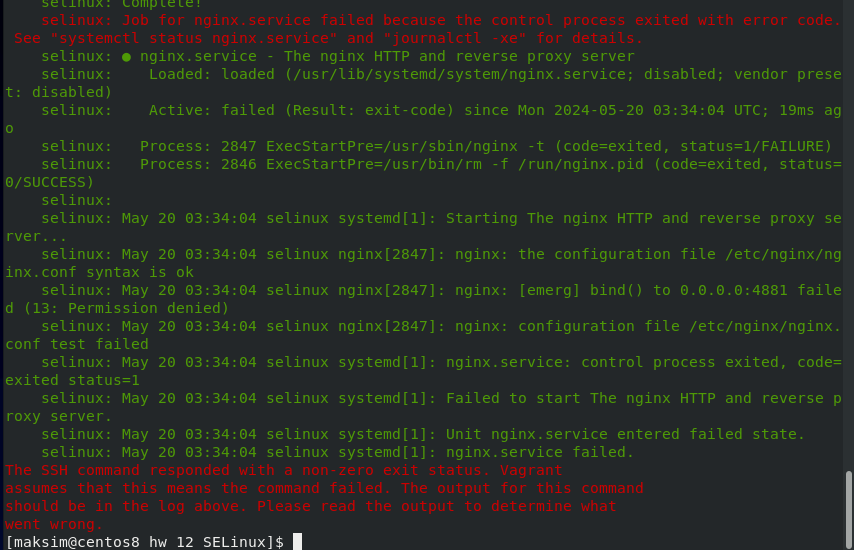
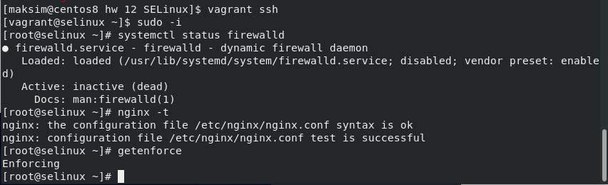
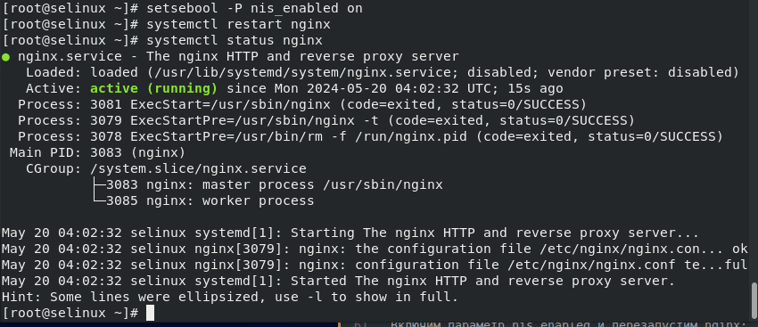

## Домашее задание № 12 SELinux

### Занятие 18. SELinux

#### Цель

Диагностировать проблемы и модифицировать политики SELinux для корректной работы приложений, если это требуется.

#### Описание домашнего задания

1. Запустить nginx на нестандартном порту 3-мя разными способами:
- переключатели setsebool;
- добавление нестандартного порта в имеющийся тип;
- формирование и установка модуля SELinux.
К сдаче:
- README с описанием каждого решения (скриншоты и демонстрация приветствуются). 

2. Обеспечить работоспособность приложения при включенном selinux.
- развернуть приложенный стенд https://github.com/mbfx/otus-linux-adm/tree/master/selinux_dns_problems; 
- выяснить причину неработоспособности механизма обновления зоны (см. README);
- предложить решение (или решения) для данной проблемы;
- выбрать одно из решений для реализации, предварительно обосновав выбор;
- реализовать выбранное решение и продемонстрировать его работоспособность

#### Ход работы

0. Создаём виртуальную машину

Создаём каталог, в котором будут храниться настройки виртуальной машины. В каталоге создаём файл с именем Vagrantfile, добавляем в него содержимое согласно методичке.

Результатом выполнения команды vagrant up станет созданная виртуальная машина с установленным nginx, который работает на порту TCP 4881. Порт TCP 4881 уже проброшен до хоста. SELinux включен.

Во время развёртывания стенда попытка запустить nginx завершится с ошибкой:



1. Запуск nginx на нестандартном порту 3-мя разными способами 

Выполним предварительные проверки согласно методичке:



##### Разрешим в SELinux работу nginx на порту TCP 4881 c помощью переключателей setsebool

Находим в логах (/var/log/audit/audit.log) информацию о блокировании порта

```
[root@selinux ~]# audit2why < /var/log/audit/audit.log
type=AVC msg=audit(1716176044.871:831): avc:  denied  { name_bind } for  pid=2847 comm="nginx" src=4881 scontext=system_u:system_r:httpd_t:s0 tcontext=system_u:object_r:unreserved_port_t:s0 tclass=tcp_socket permissive=0

    Was caused by:
    The boolean nis_enabled was set incorrectly. 
    Description:
    Allow nis to enabled

    Allow access by executing:
    # setsebool -P nis_enabled 1

```

Включим параметр nis_enabled и перезапустим nginx: 



Вернём запрет работы nginx на порту 4881 обратно. Для этого отключим nis_enabled: setsebool -P nis_enabled off

##### Теперь разрешим в SELinux работу nginx на порту TCP 4881 c помощью добавления нестандартного порта в имеющийся тип:

Поиск имеющегося типа, для http трафика:

```
[root@selinux ~]# semanage port -l | grep http
http_cache_port_t              tcp      8080, 8118, 8123, 10001-10010
http_cache_port_t              udp      3130
http_port_t                    tcp      80, 81, 443, 488, 8008, 8009, 8443, 9000
pegasus_http_port_t            tcp      5988
pegasus_https_port_t           tcp      5989
[root@selinux ~]# ^C

```

Добавим порт в тип http_port_t:

```

[root@selinux ~]# semanage port -a -t http_port_t -p tcp 4881
[root@selinux ~]# semanage port -l | grep http
http_cache_port_t              tcp      8080, 8118, 8123, 10001-10010
http_cache_port_t              udp      3130
http_port_t                    tcp      4881, 80, 81, 443, 488, 8008, 8009, 8443, 9000
pegasus_http_port_t            tcp      5988
pegasus_https_port_t           tcp      5989

```
Теперь перезапустим службу nginx и проверим её работу: systemctl restart nginx

```
[root@selinux ~]# systemctl restart nginx
[root@selinux ~]# systemctl st
start   status  stop    
[root@selinux ~]# systemctl st
start   status  stop    
[root@selinux ~]# systemctl status nginx
● nginx.service - The nginx HTTP and reverse proxy server
   Loaded: loaded (/usr/lib/systemd/system/nginx.service; disabled; vendor preset: disabled)
   Active: active (running) since Mon 2024-05-20 06:17:28 UTC; 16s ago
  Process: 21991 ExecStart=/usr/sbin/nginx (code=exited, status=0/SUCCESS)
  Process: 21989 ExecStartPre=/usr/sbin/nginx -t (code=exited, status=0/SUCCESS)
  Process: 21988 ExecStartPre=/usr/bin/rm -f /run/nginx.pid (code=exited, status=0/SUCCESS)
 Main PID: 21993 (nginx)
   CGroup: /system.slice/nginx.service
           ├─21993 nginx: master process /usr/sbin/nginx
           └─21994 nginx: worker process

May 20 06:17:28 selinux systemd[1]: Starting The nginx HTTP and reverse proxy server...
May 20 06:17:28 selinux nginx[21989]: nginx: the configuration file /etc/nginx/nginx.conf ... ok
May 20 06:17:28 selinux nginx[21989]: nginx: configuration file /etc/nginx/nginx.conf test...ful
May 20 06:17:28 selinux systemd[1]: Started The nginx HTTP and reverse proxy server.
Hint: Some lines were ellipsized, use -l to show in full.

```

Удалить нестандартный порт из имеющегося типа можно с помощью команды: semanage port -d -t http_port_t -p tcp 4881

