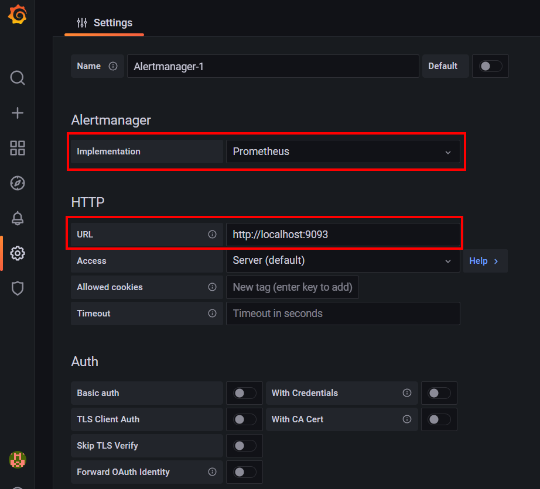
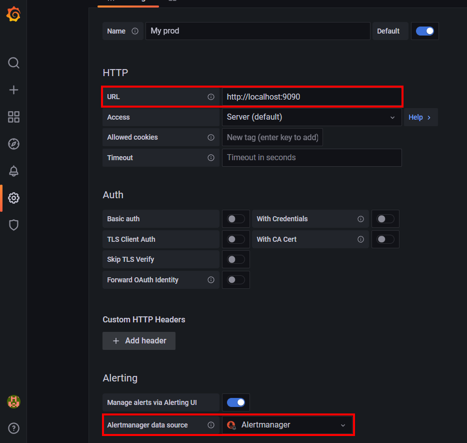
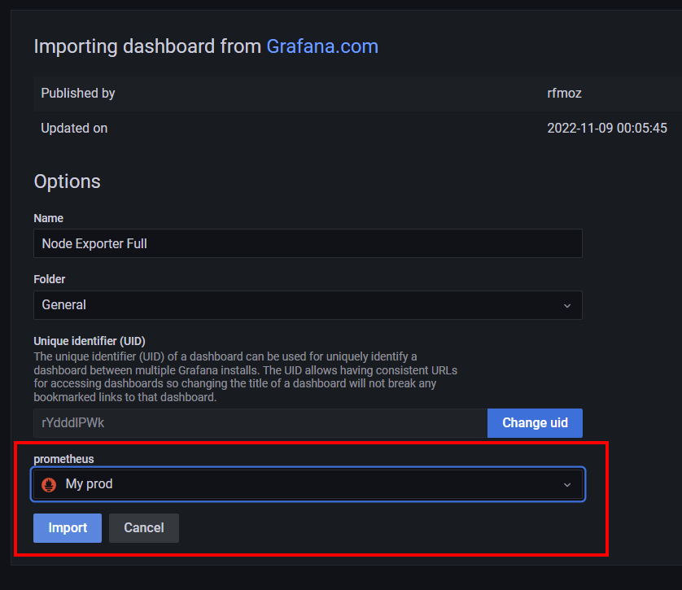
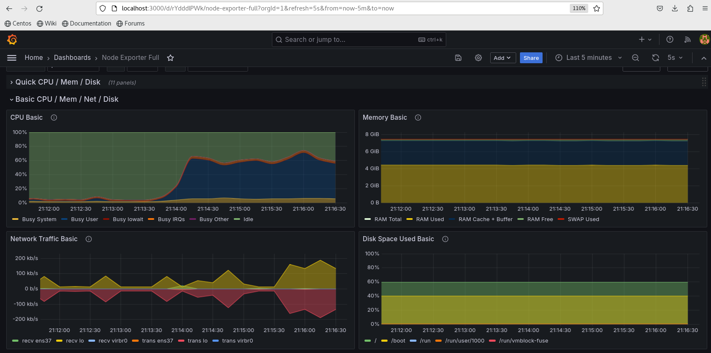

## Домашее задание № 14 Prometheus

### Занятие 22. Prometheus

#### Описание домашнего задания

Настроить дашборд с 4-мя графиками
    память;
    процессор;
    диск;
    сеть.
    Настроить на одной из систем:
    zabbix (использовать screen (комплексный экран);
    prometheus - grafana.

#### Ход работы

Для установки Prometheus использована статья:
```
https://www.dmosk.ru/instruktions.php?object=prometheus-linux
```

##### Основные моменты:

##### 1. Установка Prometheus

```
wget https://github.com/prometheus/prometheus/releases/download/v2.52.0/prometheus-2.52.0.linux-amd64.tar.gz
```

Распакуем архив.

```
cp prometheus promtool /usr/local/bin/
cp -r console_libraries consoles prometheus.yml /etc/prometheus
```

Назнаечние прав

```
useradd --no-create-home --shell /bin/false prometheus

chown -R prometheus:prometheus /etc/prometheus /var/lib/prometheus

chown prometheus:prometheus /usr/local/bin/{prometheus,promtool}
```

```
sudo -u prometheus /usr/local/bin/prometheus --config.file /etc/prometheus/prometheus.yml --storage.tsdb.path /var/lib/prometheus/ --web.console.templates=/etc/prometheus/consoles --web.console.libraries=/etc/prometheus/console_libraries
```
Автозапуск

```
vi /etc/systemd/system/prometheus.service

[Unit]
Description=Prometheus Service
Documentation=https://prometheus.io/docs/introduction/overview/
After=network.target

[Service]
User=prometheus
Group=prometheus
Type=simple
ExecStart=/usr/local/bin/prometheus \
 --config.file /etc/prometheus/prometheus.yml \
 --storage.tsdb.path /var/lib/prometheus/ \
 --web.console.templates=/etc/prometheus/consoles \
 --web.console.libraries=/etc/prometheus/console_libraries
ExecReload=/bin/kill -HUP $MAINPID
Restart=on-failure

[Install]
WantedBy=multi-user.target
-------------------------

systemctl enable prometheus

systemctl start prometheus


http://<IP-адрес сервера>:9090
```

##### 2. Установка Alertmanager

Загрузка и установка

```
wget https://github.com/prometheus/alertmanager/releases/download/v0.27.0/alertmanager-0.27.0.linux-amd64.tar.gz

mkdir -p /etc/alertmanager /var/lib/prometheus/alertmanager

cp alertmanager amtool /usr/local/bin/

cp alertmanager.yml /etc/alertmanager

useradd --no-create-home --shell /bin/false alertmanager

chown -R alertmanager:alertmanager /etc/alertmanager /var/lib/prometheus/alertmanager
chown alertmanager:alertmanager /usr/local/bin/{alertmanager,amtool}

```

Автозапуск

```


vi /etc/systemd/system/alertmanager.service

[Unit]
Description=Alertmanager Service
After=network.target

[Service]
EnvironmentFile=-/etc/default/alertmanager
User=alertmanager
Group=alertmanager
Type=simple
ExecStart=/usr/local/bin/alertmanager \
          --config.file=/etc/alertmanager/alertmanager.yml \
          --storage.path=/var/lib/prometheus/alertmanager \
          --cluster.advertise-address=0.0.0.0:9093 \
          $ALERTMANAGER_OPTS
ExecReload=/bin/kill -HUP $MAINPID
Restart=on-failure

[Install]
WantedBy=multi-user.target
------------------

systemctl enable alertmanager

systemctl start alertmanager


http://<IP-адрес сервера>:9093
```

#### 3. Установка Node Exporter

```

wget https://github.com/prometheus/node_exporter/releases/download/v1.8.1/node_exporter-1.8.1.linux-amd64.tar.gz

cp node_exporter /usr/local/bin/

useradd --no-create-home --shell /bin/false nodeusr

chown -R nodeusr:nodeusr /usr/local/bin/node_exporter
```
Автозапуск
```


vi /etc/systemd/system/node_exporter.service

[Unit]
Description=Node Exporter Service
After=network.target

[Service]
User=nodeusr
Group=nodeusr
Type=simple
ExecStart=/usr/local/bin/node_exporter
ExecReload=/bin/kill -HUP $MAINPID
Restart=on-failure

[Install]
WantedBy=multi-user.target
-----------------------------

systemctl enable node_exporter


systemctl start node_exporter


 http://<IP-адрес сервера или клиента>:9100/metrics
```

#### 4. Установка Grafana

Установка

Добавляем репо

```
vi /etc/yum.repos.d/grafana.repo

[grafana]
name=grafana
baseurl=https://packages.grafana.com/oss/rpm
repo_gpgcheck=1
enabled=1
gpgcheck=1
gpgkey=https://packages.grafana.com/gpg.key
sslverify=1
sslcacert=/etc/pki/tls/certs/ca-bundle.crt

```

Запуск сервера 

```
systemctl enable grafana-server

systemctl start grafana-server

```

#### 5. Установка Grafana

```
https://www.dmosk.ru/miniinstruktions.php?mini=grafana-install
```

##### Основные моменты

Установка

Создаем файл конфигурации репозитория для графаны:

```
vi /etc/yum.repos.d/grafana.repo

[grafana]
name=grafana
baseurl=https://packages.grafana.com/oss/rpm
repo_gpgcheck=1
enabled=1
gpgcheck=1
gpgkey=https://packages.grafana.com/gpg.key
sslverify=1
sslcacert=/etc/pki/tls/certs/ca-bundle.crt

```

Теперь можно устанавливать:

```
yum install grafana
```

#### 6. Настройка Grafana с Prometheus

```
https://1cloud.ru/blog/grafana_prometheus_system
```

##### Основные моменты

Если у вас установлен и работает Alertmanager перед добавлением источника данных, необходимо настроить его интеграцию с Grafana. Для этого на левой боковой панели управления выберите пункт «Конфигурация», вкладку «Плагины» и кликнете по Alertmanager.
В открывшемся меню настроек Alertmanager надо обязательно настроить две опции подключения: имплементация должна быть выставлена как Prometheus, а адрес подключения обязательно должен содержать протокол подключения — http:// и порт Alertmanager — по умолчанию 9093:



После сохранения настроек можно возвращаться на центральную страницу Grafana, где кликом по кнопке можно добавить источник данных.
Альтернативный путь подключения источника данных лежит через левую боковую панель. В ней нужно найти вкладку «Конфигурация», пункт меню «Источники данных» и нажать кнопку «Добавить источник данных».
Вне зависимости от пути добавления источника данных вы окажетесь на этапе выбора типа подключения баз данных — выберете Prometheus.
В открывшихся настройках подключения Prometheus нас интересует пока только два пункта: URL подключения — адрес сервера указывается с портом доступа к Prometheus; Alertmanager data source — выбирается из заранее преднастроенного с предыдущего шага источника.



##### Работа с дашбордами Grafana
```
https://grafana.com/grafana/dashboards/
```
Скачиваем NodeExporterFull и имортируем в Grafana, выбирая источник данных Prometheus


После импорта откроется дашборд, где вы сможете выбрать нужный вам для мониторинга сервер из списка: 

Скачиваем NodeExporterFull и имортируем в Grafana, выбирая источник данных Prometheus
