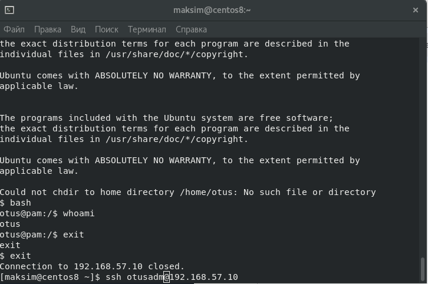
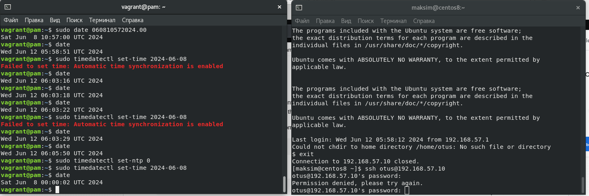
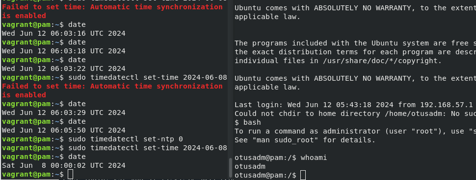

## Домашее задание № 15 PAM

### Занятие 24. Пользователи и группы. Авторизация и аутентификация

#### Цель

Научиться создавать пользователей и добавлять им ограничения

#### Описание домашнего задания

Запретить всем пользователям кроме группы admin логин в выходные (суббота и воскресенье), без учета праздников


#### Ход работы

Запустим виртуальную машину на основе Vagrantfile по методичке.

Настройка запрета для всех пользователей (кроме группы Admin) логина в выходные дни (Праздники не учитываются)

1. Подключаемся к нашей созданной ВМ: vagrant ssh
2. Переходим в root-пользователя: sudo -i
3. Создаём пользователя otusadm и otus: sudo useradd otusadm && sudo useradd otus
4. Создаём пользователям пароли: echo "Otus2024!" | sudo passwd --stdin otusadm && echo "Otus2024!" | sudo passwd --stdin otus
5. Создаём группу admin: sudo groupadd -f admin
6. Добавляем пользователей vagrant,root и otusadm в группу admin:
usermod otusadm -a -G admin && usermod root -a -G admin && usermod vagrant -a -G admin
После создания пользователей, нужно проверить, что они могут подключаться по SSH к нашей ВМ. Для этого пытаемся подключиться с хостовой машины: 
ssh otus@192.168.57.10



Далее настроим правило, по которому все пользователи кроме тех, что указаны в группе admin не смогут подключаться в выходные дни.

7. Создадим файл-скрипт /usr/local/bin/login.sh
```
vim /usr/local/bin/login.sh

#!/bin/bash
#Первое условие: если день недели суббота или воскресенье
if [ $(date +%a) = "Sat" ] || [ $(date +%a) = "Sun" ]; then
 #Второе условие: входит ли пользователь в группу admin
 if getent group admin | grep -qw "$PAM_USER"; then
        #Если пользователь входит в группу admin, то он может подключиться
        exit 0
      else
        #Иначе ошибка (не сможет подключиться)
        exit 1
    fi
  #Если день не выходной, то подключиться может любой пользователь
  else
    exit 0
fi
```

В скрипте подписаны все условия. Скрипт работает по принципу: 
Если сегодня суббота или воскресенье, то нужно проверить, входит ли пользователь в группу admin, если не входит — то подключение запрещено. При любых других вариантах подключение разрешено. 

8. Добавим права на исполнение файла: chmod +x /usr/local/bin/login.sh

9. Укажем в файле /etc/pam.d/sshd модуль pam_exec и наш скрипт:

```
vim /etc/pam.d/sshd 


#%PAM-1.0
auth       substack     password-auth
auth       include      postlogin
auth required pam_exec.so debug /usr/local/bin/login.sh
account    required     dad
account    required     pam_nologin.so
account    include      password-auth
password   include      password-auth
# pam_selinux.so close should be the first session rule
session    required     pam_selinux.so close
session    required     pam_loginuid.so
# pam_selinux.so open should only be followed by sessions to be executed in the user context
session    required     pam_selinux.so open env_params
session    required     pam_namespace.so
session    optional     pam_keyinit.so force revoke
session    optional     pam_motd.so
session    include      password-auth
session    include      postlogin

```

На этом настройка завершена, нужно только проверить, что скрипт отрабатывает корректно. 

При логине пользователя otus - ошибка доступа. 



Залогинимся под otusadm - вход без ошибки

