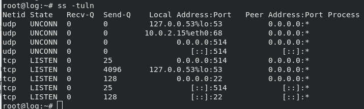

## Домашее задание № 16 Logs

### Занятие 25. Основы сбора и хранения логов 

#### Цель

Научится проектировать централизованный сбор логов;
Рассмотреть особенности разных платформ для сбора логов.

#### Описание домашнего задания

1. В Vagrant разворачиваем 2 виртуальные машины web и log
2. на web настраиваем nginx
3. на log настраиваем центральный лог сервер на любой системе на выбор
journald;
rsyslog;
elk.
4. настраиваем аудит, следящий за изменением конфигов nginx 

Все критичные логи с web должны собираться и локально и удаленно.
Все логи с nginx должны уходить на удаленный сервер (локально только критичные).
Логи аудита должны также уходить на удаленную систему.

#### Ход работы

1. Создаём виртуальные машины

Vagrantfile согласно методичке.

Результатом выполнения команды vagrant up станут 2 созданные виртуальные машины
Заходим на web-сервер: vagrant ssh web
Дальнейшие действия выполняются от пользователя root. Переходим в root пользователя: sudo -i
Для правильной работы c логами, нужно, чтобы на всех хостах было настроено одинаковое время. 

2. Установка nginx на виртуальной машине web

Установим nginx: apt update && apt install -y nginx  

Проверим, что nginx работает корректно:

3. Настройка центрального сервера сбора логов

Откроем еще одно окно терминала и подключаемся по ssh к ВМ log: vagrant ssh log
Перейдем в пользователя root: sudo -i
rsyslog должен быть установлен по умолчанию в нашей ОС, проверим это:

Все настройки Rsyslog хранятся в файле /etc/rsyslog.conf 
Для того, чтобы наш сервер мог принимать логи, нам необходимо внести следующие изменения в файл: 
Открываем порт 514 (TCP и UDP):
Приводим файл к виду:

Данные параметры будут отправлять в папку /var/log/rsyslog логи, которые будут приходить от других серверов. Например, Access-логи nginx от сервера web, будут идти в файл /var/log/rsyslog/web/nginx_access.log
Далее сохраняем файл и перезапускаем службу rsyslog: systemctl restart rsyslog
Если ошибок не допущено, то у нас будут видны открытые порты TCP,UDP 514:

Далее настроим отправку логов с web-сервера

Для Access-логов указываем удаленный сервер и уровень логов, которые нужно отправлять. Для error_log добавляем удаленный сервер. Если требуется чтобы логи хранились локально и отправлялись на удаленный сервер, требуется указать 2 строки.   
Tag нужен для того, чтобы логи записывались в разные файлы.
По умолчанию, error-логи отправляют логи, которые имеют severity: error, crit, alert и emerg. Если требуется хранить или пересылать логи с другим severity, то это также можно указать в настройках nginx. 

Далее проверяем, что конфигурация nginx указана правильно: nginx -t

Далее перезапускаем nginx: systemctl restart nginx

Попробуем несколько раз зайти по адресу http://192.168.56.10
Далее заходим на log-сервер и смотрим информацию об nginx:
cat /var/log/rsyslog/web/nginx_access.log 
cat /var/log/rsyslog/web/nginx_error.log 

Поскольку наше приложение работает без ошибок, файл nginx_error.log не будет создан. Чтобы сгенерировать ошибку, можно переместить файл веб-страницы, который открывает nginx - 
mv /var/www/html/index.nginx-debian.html /var/www/ 
После этого мы получим 403 ошибку.
Видим, что логи отправляются корректно. 

На этом выполнение ДЗ завершено!