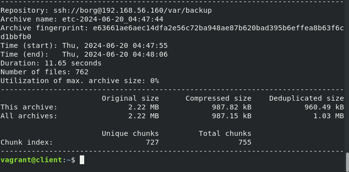
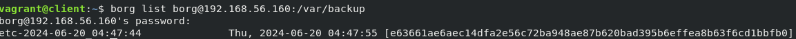
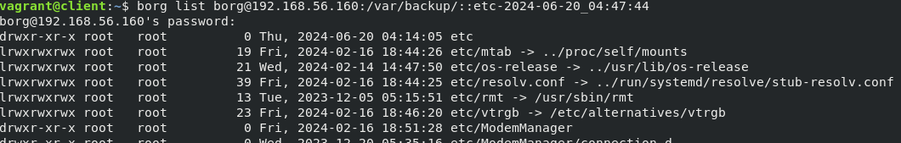
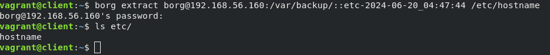
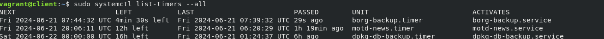
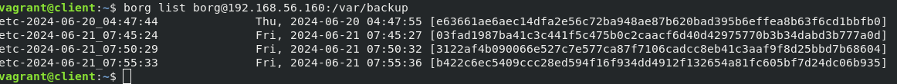

## Домашее задание № 17 Backup

### Занятие 27. Резервное копирование 

#### Цель

Настроить бэкапы.

#### Описание домашнего задания

1. Настроить стенд Vagrant с двумя виртуальными машинами: backup_server и client. (Студент самостоятельно настраивает Vagrant)

2. Настроить удаленный бэкап каталога /etc c сервера client при помощи borgbackup. Резервные копии должны соответствовать следующим критериям:
- директория для резервных копий /var/backup. Это должна быть отдельная точка монтирования. В данном случае для демонстрации размер не принципиален, достаточно будет и 2GB; (Студент самостоятельно настраивает)
- репозиторий для резервных копий должен быть зашифрован ключом или паролем - на усмотрение студента;
- имя бэкапа должно содержать информацию о времени снятия бекапа;
- глубина бекапа должна быть год, хранить можно по последней копии на конец месяца, кроме последних трех. Последние три месяца должны содержать копии на каждый день. Т.е. должна быть правильно настроена политика удаления старых бэкапов;
- резервная копия снимается каждые 5 минут. Такой частый запуск в целях демонстрации;
- написан скрипт для снятия резервных копий. Скрипт запускается из соответствующей Cron джобы, либо systemd timer-а - на усмотрение студента;
- настроено логирование процесса бекапа. Для упрощения можно весь вывод перенаправлять в logger с соответствующим тегом. Если настроите не в syslog, то обязательна ротация логов.


#### Ход работы


1. Создаём виртуальные машины

Vagrantfile 

Тестовый стенд:
backup 192.168.56.160 Ubuntu 22.04
client 192.168.56.150 Ubuntu 22.04

2. Устанавливаем на client и backup сервере borgbackup

```
apt install borgbackup
```

3. На сервере backup создаем пользователя и каталог /var/backup (в домашнем задании нужно будет создать диск ~2Gb и примонтировать его) и назначаем на него права пользователя borg	

```
mkdir /var/backup
chown borg:borg /var/backup/
```

4. На сервер backup создаем каталог ~/.ssh/authorized_keys в каталоге /home/borg

```
su - borg
mkdir .ssh
touch .ssh/authorized_keys
chmod 700 .ssh
chmod 600 .ssh/authorized_keys
```

На сервере client: 
```
ssh-keygen
```

Все дальнейшие действия будут проходить на client сервере.

Инициализируем репозиторий borg на backup сервере с client сервера:
```
borg init --encryption=repokey borg@192.168.56.160:/var/backup/
```

Запускаем для проверки создания бэкапа
```
borg create --stats --list borg@192.168.56.160:/var/backup/::"etc-{now:%Y-%m-%d_%H:%M:%S}" /etc
```



Смотрим, что у нас получилось
```
borg list borg@192.168.56.160:/var/backup/
```


Смотрим список файлов
```
borg list borg@192.168.56.160:/var/backup/::etc-2021-10-15_23:00:15
```


Достаем файл из бекапа

```
borg extract borg@192.168.56.160:/var/backup/::etc-2021-10-15_23:00:15 etc/hostname
```



Автоматизируем создание бэкапов с помощью systemd
Создаем сервис и таймер в каталоге /etc/systemd/system/
```
vim /etc/systemd/system/borg-backup.service
[Unit]
Description=Borg Backup

[Service]
Type=oneshot

# Парольная фраза

# Репозиторий
Environment=REPO=borg@192.168.56.160:/var/backup/
# Что бэкапим
Environment=BACKUP_TARGET=/etc

# Создание бэкапа
ExecStart=/bin/borg create \
    --stats                \
    ${REPO}::etc-{now:%%Y-%%m-%%d_%%H:%%M:%%S} ${BACKUP_TARGET}

# Проверка бэкапа
ExecStart=/bin/borg check ${REPO}

# Очистка старых бэкапов
ExecStart=/bin/borg prune \
    --keep-daily  90      \
    --keep-monthly 12     \
    --keep-yearly  1       \
    ${REPO}


# vim /etc/systemd/system/borg-backup.timer
[Unit]
Description=Borg Backup
Requires=borg-backup.service

[Timer]
Unit=borg-backup.service
OnUnitActiveSec=5min

[Install]
WantedBy=timers.target
```

Включаем и запускаем службу таймера
```
systemctl enable borg-backup.timer 
systemctl start borg-backup.timer
```

Проверяем работу таймера
systemctl list-timers --all




Проверяем список бэкапов




