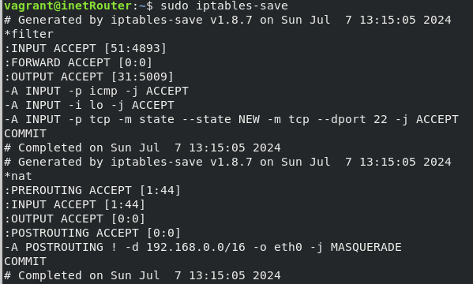

## Домашее задание № 18 Network

### Занятие 28. Архитектура сетей

#### Цель

Научится менять базовые сетевые настройки в Linux-based системах.

#### Описание домашнего задания

1. Скачать и развернуть Vagrant-стенд https://github.com/erlong15/otus-linux/tree/network
2. Построить следующую сетевую архитектуру:
Сеть office1
- 192.168.2.0/26      - dev
- 192.168.2.64/26     - test servers
- 192.168.2.128/26    - managers
- 192.168.2.192/26    - office hardware

Сеть office2
- 192.168.1.0/25      - dev
- 192.168.1.128/26    - test servers
- 192.168.1.192/26    - office hardware

Сеть central
- 192.168.0.0/28     - directors
- 192.168.0.32/28    - office hardware
- 192.168.0.64/26    - wifi

Итого должны получиться следующие сервера:
inetRouter
centralRouter
office1Router
office2Router
centralServer
office1Server
office2Server

Задание состоит из 2-х частей: теоретической и практической.
В теоретической части требуется: 
Найти свободные подсети
Посчитать количество узлов в каждой подсети, включая свободные
Указать Broadcast-адрес для каждой подсети
Проверить, нет ли ошибок при разбиении

В практической части требуется: 
Соединить офисы в сеть согласно логической схеме и настроить роутинг
Интернет-трафик со всех серверов должен ходить через inetRouter
Все сервера должны видеть друг друга (должен проходить ping)
У всех новых серверов отключить дефолт на NAT (eth0), который vagrant поднимает для связи
Добавить дополнительные сетевые интерфейсы, если потребуется


#### Ход работы

#### Теоретическая часть

В теоретической части нам необходимо продумать топологию сети, а также:
Найти свободные подсети
Посчитать количество узлов в каждой подсети, включая свободные
Указать Broadcast-адрес для каждой подсети
Проверить, нет ли ошибок при разбиении

Первым шагом мы рассмотрим все сети, указанные в задании. Посчитаем для них количество узлов, найдём Broadcast-адрес, проверим, нет ли ошибок при разбиении.

После расчета всех сетей, получаем следующую таблицу топологии

|   Name            | Network          | Netmask         |  N  |   Hostmin     |   Hostmax     |  Broadcast    | 
|-------------------|------------------|-----------------|-----|---------------|---------------|---------------|
|Central Network        
|Directors          | 192.168.0.0/28   | 255.255.255.240 | 14  | 192.168.0.1   | 192.168.0.14  | 192.168.0.15  |
|Office hardware    | 192.168.0.32/28  | 255.255.255.240 | 14  | 192.168.0.33  | 192.168.0.46  | 192.168.0.47  |
|WiFi (mgt network) | 192.168.0.64/26  | 255.255.255.192 | 62  | 192.168.0.65  | 192.168.0.126 | 192.168.0.127 |
|Office 1 Network   
|Dev                | 192.168.2.0/26   | 255.255.255.192 | 62  | 192.168.2.1   | 192.168.2.62  | 192.168.2.63  |
|Test               | 192.168.2.64/26  | 255.255.255.192 | 62  | 192.168.2.65  | 192.168.2.126 | 192.168.2.127 |
|Managers           | 192.168.2.128/26 | 255.255.255.192 | 62  | 192.168.2.129 | 192.168.2.190 | 192.168.2.191 |
|Office hardware    | 192.168.2.192/26 | 255.255.255.192 | 62  | 192.168.2.193 | 192.168.2.254 | 192.168.2.255 |
|Office 2 Network
|Dev                | 192.168.1.0/25   | 255.255.255.128 | 126 | 192.168.1.1   | 192.168.1.126 | 192.168.1.127 |  
|Test               | 192.168.1.128/26 | 255.255.255.192 | 62  | 192.168.1.129 | 192.168.1.190 | 192.168.1.191 |  
|Office             | 192.168.1.192/26 | 255.255.255.192 | 63  | 192.168.1.193 | 192.168.1.254 | 192.168.1.255 | 
|InetRouter — CentralRouter network
|Inet-central       | 192.168.255.0/30 | 255.255.255.252 | 2   | 192.168.255.1 | 192.168.255.2 | 192.168.255.3 |  

После создания таблицы топологии, мы видим, что ошибок в задании нет, также мы сразу видим следующие свободные сети: 

192.168.0.16/28 
192.168.0.48/28
192.168.0.128/25
192.168.255.64/26
192.168.255.32/27
192.168.255.16/28
192.168.255.8/29  
192.168.255.4/30 


#### Практическая часть


На основании этой схемы мы получаем готовый список серверов.
Server

```
+=================+=================+
|     IP-адрес     | IP and Bitmask |
+-----------------+-----------------+
|                  |  Default-NAT address VirtualBox     |
|    inetRouter    |-----------------------------
|                  |   192.168.255.1/30          
|------------------|---------------------------------
|                  |  192.168.255.2/30
|                  |------------------------
|                  |  192.168.0.1/28
|                  |------------------------
|                  |  192.168.0.33/28
|                  |------------------------
|  centralRouter   |  192.168.0.65/26
|                  |------------------------
|                  |  192.168.255.9/30
|                  |------------------------
|                  |  192.168.255.5/30
|------------------|------------------------
|  centralServer   |  192.168.0.2/28   
|------------------|-------------------------
|                  |  192.168.255.10/30
|                  |-------------------------
|                  |  192.168.2.1/26
|                  |-----------------------------
|  office1Router   |  192.168.2.65/26
|                  |-------------------------
|                  |  192.168.2.129/26
|                  |-----------------------------
|                  |  192.168.2.193/26
|------------------|-------------------------
|  office1Server   |  192.168.2.130/26
|------------------|-----------------------------
|                  |  192.168.255.6/30
|                  |--------------------------
|                  |  192.168.1.1/26  
|  office2Router   |-------------------------
|                  |  192.168.1.129/26
|                  |---------------------------
|                  |  192.168.1.193/26
|------------------|---------------------------
|  office2Server   |  192.168.1.2/26
+------------------+-----------------------

```

Скачаем Vagrantfile из репозитория https://github.com/erlong15/otus-linux/tree/network
И приведем в вид согласно методичким рекомендациям.

#### Настройка NAT

Для того, чтобы правила применялись после перезагрузки, в Ubuntu 22.04 нужно выполнить следующие действия:


1)Подключиться по SSH к хосту: vagrant ssh inetRouter
2)Проверить, что отключен другой файервол: systemctl status ufw
root@inetRouter:~# systemctl status ufw
● ufw.service - Uncomplicated firewall
     Loaded: loaded (/lib/systemd/system/ufw.service; enabled; vendor preset: enabled)
     Active: active (exited) since Sat 2023-10-14 15:48:04 UTC; 7min ago
       Docs: man:ufw(8)
   Main PID: 517 (code=exited, status=0/SUCCESS)
        CPU: 3ms

Oct 14 15:48:04 inetRouter systemd[1]: Starting Uncomplicated firewall...
Oct 14 15:48:04 inetRouter systemd[1]: Finished Uncomplicated firewall.
root@inetRouter:~#


Если служба будет запущена, то нужно её отключить и удалить из автозагрузки:
systemctl stop ufw
systemctl disable ufw


3) Создаём файл /etc/iptables_rules.ipv4:
vi /etc/iptables_rules.ipv4

# Generated by iptables-save v1.8.7 on Sat Oct 14 16:14:36 2023
*filter
:INPUT ACCEPT [90:8713]
:FORWARD ACCEPT [0:0]
:OUTPUT ACCEPT [54:7429]
-A INPUT -p icmp -j ACCEPT
-A INPUT -i lo -j ACCEPT
-A INPUT -p tcp -m state --state NEW -m tcp --dport 22 -j ACCEPT
COMMIT
# Completed on Sat Oct 14 16:14:36 2023
# Generated by iptables-save v1.8.7 on Sat Oct 14 16:14:36 2023
*nat
:PREROUTING ACCEPT [1:44]
:INPUT ACCEPT [1:44]
:OUTPUT ACCEPT [0:0]
:POSTROUTING ACCEPT [0:0]
-A POSTROUTING ! -d 192.168.0.0/16 -o eth0 -j MASQUERADE
COMMIT
# Completed on Sat Oct 14 16:14:36 2023


4) Создаём файл, в который добавим скрипт автоматического восстановления правил при перезапуске системы:
vi /etc/network/if-pre-up.d/iptables

#!/bin/sh
/sbin/iptables-restore < /etc/iptables_rules.ipv4

5) Добавляем права на выполнение файла /etc/network/if-pre-up.d/iptables
sudo chmod +x /etc/network/if-pre-up.d/iptables

6) Перезагружаем сервер: reboot
7) После перезагрузки сервера проверяем правила iptables: iptables-save



#### Маршрутизация транзитных пакетов (IP forward)

Важным этапом настройки сетевой лаборатории, является маршрутизация транзитных пакетов. Если объяснить простыми словами — это возможность сервера Linux пропускать трафик через себя к другому серверу. По умолчанию эта функция отключена в Linux. Включить её можно командой: 
echo "net.ipv4.conf.all.forwarding = 1" >> /etc/sysctl.conf
sysctl -p

Посмотреть статус форвардинга можно командой: sysctl net.ipv4.ip_forward
Если параметр равен 1, то маршрутизация транзитных пакетов включена, если 0 — отключена. 

В нашей схеме необходимо включить данную маршрутизацию на всех роутерах.

#### Отключение маршрута по умолчанию на интерфейсе eth0

При разворачивании нашего стенда Vagrant создает в каждом сервере свой интерфейс, через который у сервера появляется доступ в интернет. Отключить данный порт нельзя, так как через него Vagrant подключается к серверам. Обычно маршрут по умолчанию прописан как раз на этот интерфейс, данный маршрут нужно отключить:


Для отключения маршрута по умолчанию в файле /etc/netplan/00-installer-config.yaml добавляем отключение маршрутов, полученных через DHCP:

# This is the network config written by 'subiquity'
network:
  ethernets:
    eth0:
      dhcp4: true
      dhcp4-overrides:
          use-routes: false
      dhcp6: false
  version: 2

После внесения данных изменений перезапускаем сетевую службу: 
netplan try

Отключение дефолтного маршрута требуется настроить на всех хостах кроме inetRouter

#### Настройка статических маршрутов

Для настройки статических маршрутов используется команда ip route. 

Давайте рассмотрим пример настройки статического маршрута на сервере office1Server. Исходя из схемы мы видим, что трафик с данного сервера будет идти через office1Router. Office1Server и office1Router у нас соединены через сеть managers (192.168.2.128/26). В статическом маршруте нужно указывать адрес следующего хоста. Таким образом мы должны указать на сервере office1Server маршрут, в котором доступ к любым IP-адресам у нас будет происходить через адрес 192.168.2.129, который расположен на сетевом интерфейсе office1Router. Команда будет выглядеть так: ip route add 0.0.0.0/0 via 192.168.2.129 

Посмотреть список всех маршрутов: ip route
root@office1Server:~# ip r
default via 192.168.2.129 dev eth1
10.0.2.0/24 dev eth0 proto kernel scope link src 10.0.2.15 metric 100
10.0.2.2 dev eth0 proto dhcp scope link src 10.0.2.15 metric 100
10.0.2.3 dev eth0 proto dhcp scope link src 10.0.2.15 metric 100
192.168.2.128/26 dev eth1 proto kernel scope link src 192.168.2.130
192.168.50.0/24 dev eth2 proto kernel scope link src 192.168.50.21
root@office1Server:~#

Удалить маршрут: ip route del 0.0.0.0/0 via 192.168.2.129 

Важно помнить, что маршруты, настроенные через команду ip route удаляются после перезагрузки или перезапуске сетевой службы. 

Для того, чтобы маршруты сохранялись после перезагрузки нужно их указывать непосредственно в файле конфигурации сетевых интерфейсов:

В современных версиях Ubuntu, для указания маршрута нужно поправить netplan-конфиг. Конфиги netplan хранятся в виде YAML-файлов и обычно лежат в каталоге /etc/netplan
В нашем стенде такой файл - /etc/netplan/50-vagrant.yaml 

Маршрут по умолчачнию на centralRouter.


При настройке интерфейсов и маршрутов в любой из ОС можно оставлять комментарии в файле. Перед комментарием должен стоять знак «#»

Настройте самостоятельно все маршруты на серверах. Важно помнить, что помимо маршрутов по умолчанию, вам нужно будет использовать обратные маршруты. 

Давайте разберем пример такого маршрута: допустим мы хотим отправить команду ping с сервера office1Server (192.168.2.130) до сервера centralRouter (192.168.0.1) 
Наш трафик пойдёт следующим образом: office1Server — office1Router — centralRouter — office1Router — office1Server

Office1Router знает сеть (192.168.2.128/26), в которой располагается сервер office1Server, а сервер centralRouter, когда получит запрос от адреса 192.168.2.130 не будет понимать, куда отправить ответ. Решением этой проблемы будет добавление обратного маршрута. 

Обратный маршрут указывается также как остальные маршруты. Изучив схему мы видим, что связь между сетями 192.168.2.0/24 и 192.168.0.0/24 осуществляется через сеть 192.168.255.8/30. Также мы видим что сети office1 подключены к centralRouter через порт eth5. На основании этих данных мы можем добавить маршрут в файл /etc/netplan/50-vagrant.yaml


Проверим результат настройки статических маршрутов.

Пинг с centralRouter до сетей 192.168.2.0 и 192.168.1.0


Пинг с office1Server до сетей 192.168.0.0 и 192.168.1.0


Пинг с office2Server до сетей 192.168.0.0 и 192.168.2.0


Трейс во внешнюю сеть

```
vagrant@office1Server:~$ ping 8.8.8.8
PING 8.8.8.8 (8.8.8.8) 56(84) bytes of data.
64 bytes from 8.8.8.8: icmp_seq=1 ttl=57 time=24.0 ms
64 bytes from 8.8.8.8: icmp_seq=2 ttl=57 time=7.01 ms
64 bytes from 8.8.8.8: icmp_seq=3 ttl=57 time=6.65 ms
64 bytes from 8.8.8.8: icmp_seq=4 ttl=57 time=6.46 ms
64 bytes from 8.8.8.8: icmp_seq=5 ttl=57 time=7.87 ms
^C
--- 8.8.8.8 ping statistics ---
5 packets transmitted, 5 received, 0% packet loss, time 4008ms
rtt min/avg/max/mdev = 6.463/10.408/24.049/6.837 ms
```

```
root@office1Server:/home/vagrant# traceroute -4I 8.8.8.8
traceroute to 8.8.8.8 (8.8.8.8), 30 hops max, 60 byte packets
 1  _gateway (192.168.2.129)  6.322 ms  6.178 ms  6.121 ms
 2  192.168.255.9 (192.168.255.9)  14.818 ms  14.741 ms  14.685 ms
 3  192.168.255.1 (192.168.255.1)  14.631 ms  14.580 ms  14.527 ms
 4  _gateway (10.0.2.2)  14.445 ms * *
 5  * * *
 6  * * *
 7  * * *
 8  * * *
 9  * * *
10  * * *
11  * * *
12  * * *
13  * * *
14  * * *
15  * * *
16  * * *
17  * * *
18  * * *
19  * * *
20  * * *
21  * * *
22  * * *
23  * * *
24  * * *
25  dns.google (8.8.8.8)  80.008 ms  79.960 ms  90.554 ms
```


