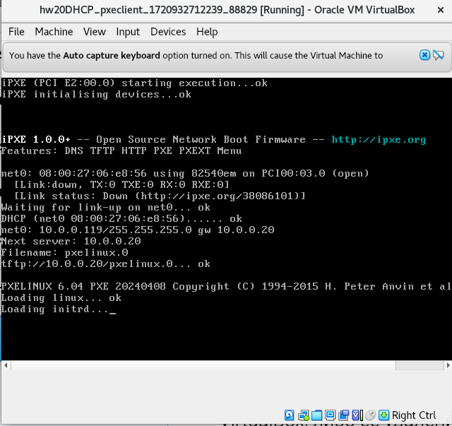
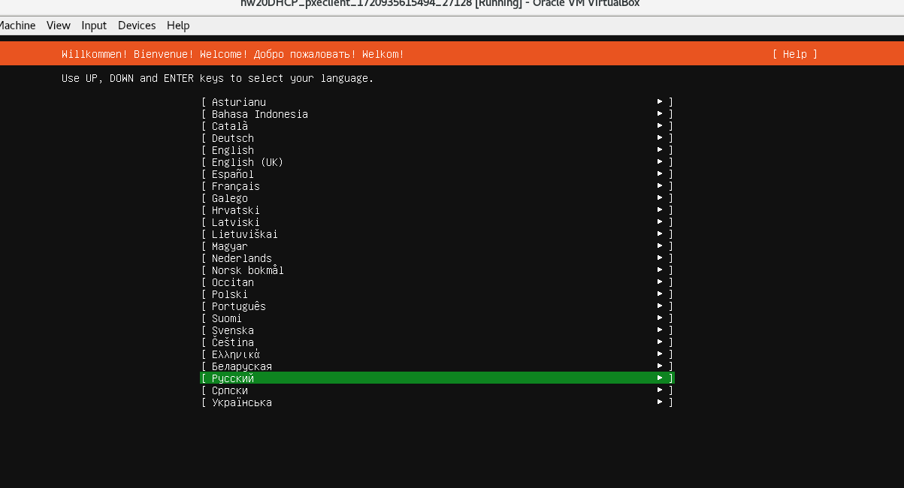
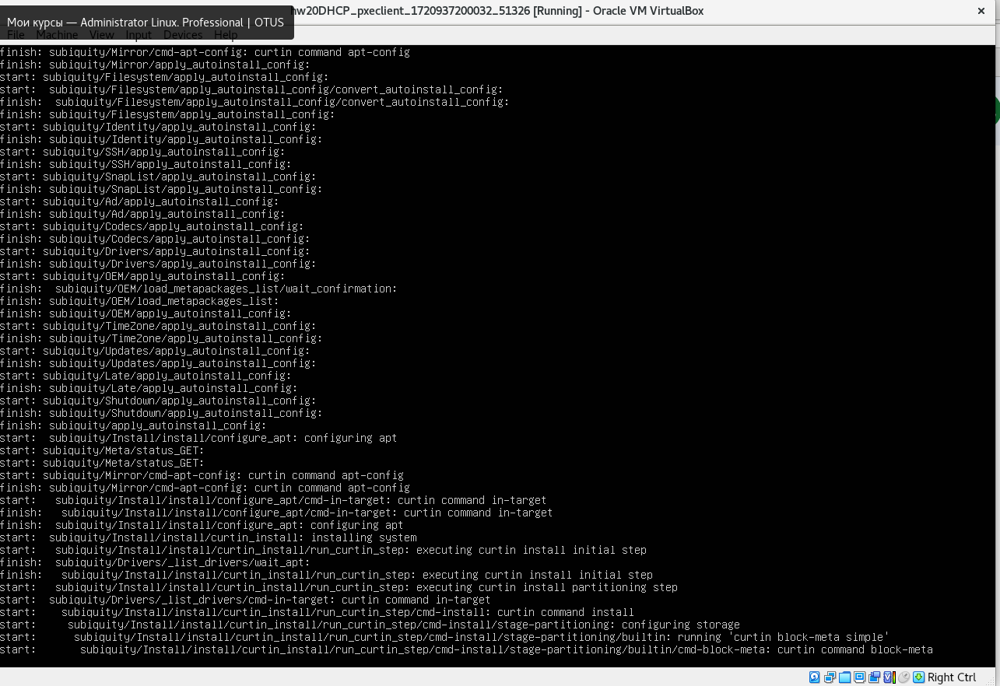

## Домашее задание № 20 DHCP

### Занятие 29. DHCP, PXE

#### Цель

Отработать навыки установки и настройки DHCP, TFTP, PXE загрузчика и автоматической загрузки

#### Описание домашнего задания

1. Настроить загрузку по сети дистрибутива Ubuntu 24
2. Установка должна проходить из HTTP-репозитория.
3. Настроить автоматическую установку c помощью файла user-data
*4. Настроить автоматическую загрузку по сети дистрибутива Ubuntu 24 c использованием UEFI
Задания со звёздочкой выполняются по желанию
Формат сдачи ДЗ: vagrant + ansible


#### Ход работы

1. Разворот хостов и настройка загрузки по сети
Подготовим Vagrantfile в котором будут описаны 2 виртуальные машины:
• pxeserver (хост к которому будут обращаться клиенты для установки ОС)
• pxeclient (хост, на котором будет проводиться установка)

1. Настройка DHCP и TFTP-сервера
Для того, чтобы наш клиент мог получить ip-адрес нам требуется DHCP-сервер, чтобы можно было получить
файл pxelinux.0 нам потребуется TFTP-сервер. Утилита dnsmasq совмещает в себе сразу и DHCP и TFTP-
сервер.
1) отключаем firewall:
```
systemctl stop ufw
systemctl disable ufw
```
2) обновляем кэш и устанавливаем утилиту dnsmasq
```
sudo apt update
sudo apt install dnsmasq
```
3) создаём файл /etc/dnsmasq.d/pxe.conf и добавляем в него следующее содержимое
vim /etc/dnsmasq.d/pxe.conf#Указываем интерфейс в на котором будет работать DHCP/TFTP
```
interface=eth1
bind-interfaces
#Также указаваем интерфейс и range адресов которые будут выдаваться по DHCP
dhcp-range=eth1,10.0.0.100,10.0.0.120
#Имя файла, с которого надо начинать загрузку для Legacy boot (этот пример рассматривается в методичке)
dhcp-boot=pxelinux.0
#Имена файлов, для UEFI-загрузки (не обязательно добавлять)
dhcp-match=set:efi-x86_64,option:client-arch,7
dhcp-boot=tag:efi-x86_64,bootx64.efi
#Включаем TFTP-сервер
enable-tftp
#Указываем каталог для TFTP-сервера
tftp-root=/srv/tftp/amd64
```
4) создаём каталоги для файлов TFTP-сервера
```
mkdir -p /srv/tftp
```
5) скачиваем файлы для сетевой установки Ubuntu 24.04 и распаковываем их в каталог /srv/tftp
```
wget http://cdimage.ubuntu.com/ubuntu-server/daily-live/current/oracular-netboot-amd64.tar.gz
tar -xzvf oracular-netboot-amd64.tar.gz -C /srv/tftp
по итогу, в каталоге /srv/tftp/amd64 мы увидем вот такие файлы:
├── bootx64.efi
├── grub
│ └── grub.cfg
├── grubx64.efi
├── initrd
├── ldlinux.c32
├── linux
├── pxelinux.0
└── pxelinux.cfg
└── default
2 directories, 8 files
```
6) перезапускаем службу dnsmasq
```
systemctl restart dnsmasq
```
2. Настройка Web-сервера
Для того, чтобы отдавать файлы по HTTP нам потребуется настроенный веб-сервер.
1) устанавливаем Web-сервер apache2
```
sudo apt install apache2
```
2) создаём каталог /srv/images в котором будут храниться iso-образы для установки по сети
```
mkdir /srv/images
```
3) переходим в каталог /srv/images и скачиваем iso-образ ubuntu 24.04
```
cd /srv/images
wget http://cdimage.ubuntu.com/ubuntu-server/daily-live/current/oracular-live-server-amd64.iso
```
4) создаём файл /etc/apache2/sites-available/ks-server.conf и добавлем в него следующее содержимое
```
vim /etc/apache2/sites-available/ks-server.conf
#Указываем IP-адрес хоста и порт на котором будет работать Web-сервер
<VirtualHost 10.0.0.20:80>
DocumentRoot /
# Указываем директорию /srv/images из которой будет загружаться iso-образ
<Directory /srv/images>
Options Indexes MultiViews
AllowOverride All
Require all granted
</Directory>
</VirtualHost>
```
5) активируем конфигурацию ks-server в apache
```
sudo a2ensite ks-server.conf
```
6) вносим изменения в файл /srv/tftp/amd64/pxelinux.cfg/default
```
vim /srv/tftp/amd64/pxelinux.cfg/default
DEFAULT install
LABEL install
KERNEL linux
INITRD initrd
APPEND root=/dev/ram0 ramdisk_size=3000000 ip=dhcp iso-url=http://10.0.0.20/srv/images/oracular-live-server-
amd64.iso autoinstall
```
В данном файле мы указываем что файлы linux и initrd будут забираться по tftp, а сам iso-образ ubuntu 24.04
будет скачиваться из нашего веб-сервера http://10.0.0.20/srv/images/oracular-live-server-amd64.iso

Из-за того, что образ достаточно большой (2.6G) и он сначала загружается в ОЗУ, необходимо указать
размер ОЗУ до 3 гигабайт (root=/dev/ram0 ramdisk_size=3000000)

7) перезагружаем web-сервер apache
```
systemctl restart apache2
```
На этом настройка Web-сервера завершена и на данный момент, если мы запустим ВМ pxeclient, то увидим
загрузку по PXE
и далее увидим загрузку iso-образа
и откроется мастер установки ubuntu





3. Настройка автоматической установки Ubuntu 24.04
Осталось автоматизировать установку ubuntu 24 (чтобы не пользоваться мастером установки вручную)
1) cоздаём каталог для файлов с автоматической установкой
```
mkdir /srv/ks
```
2) создаём файл /srv/ks/user-data и добавляем в него следующее содержимоеvim /srv/ks/user-data
```
#cloud-config
autoinstall:
 apt:
  disable_components: []
  geoip: true
  preserve_sources_list: false
  primary:
  - arches:
    - amd64
    - i386
    uri: http://us.archive.ubuntu.com/ubuntu
  - arches:
    - default
    uri: http://ports.ubuntu.com/ubuntu-ports
 drivers:
 install: false
 identity:
  hostname: linux
  password: $6$sJgo6Hg5zXBwkkI8$btrEoWAb5FxKhajagWR49XM4EAOfO/
  Dr5bMrLOkGe3KkMYdsh7T3MU5mYwY2TIMJpVKckAwnZFs2ltUJ1abOZ.
  realname: otus
  username: otus
 kernel:
 package: linux-generic
 keyboard:
  layout: us
  toggle: null
  variant: ''
 locale: en_US.UTF-8
 network:
  ethernets:
   enp0s3:
    dhcp4: true
   enp0s8:
    dhcp4: true
  version: 2
 ssh:
 allow-pw: true
 authorized-keys: []
 install-server: true
 updates: security
 version: 1
```
В данном файле указываются следующие настройки:
• устанавливается apt-репозиторий http://us.archive.ubuntu.com/ubuntu
• отключена автоматическая загрузка драйверов
• задаётся hostname linux
• создаётся пользователь otus c паролем 123 (пароль зашифрован в SHA512)
• использование английской раскладки
• добавлена настройка получения адресов по DHCP (для обоих портов)
• устанавливается openssh-сервер с доступом по логину и паролю
• и т д.

3) создаём файл с метаданными /srv/ks/meta-data
touch /srv/ks/meta-data
Файл с метаданными хранит дополнительную информацию о хосте, в нашей методичке мы не будем
добавлять дополнительную информацю

4) в конфигурации веб-сервера добавим каталог /srv/ks идёнтично каталогу /srv/images
```
cat /etc/apache2/sites-available/ks-server.conf
<VirtualHost 10.0.0.20:80>
DocumentRoot /
<Directory /srv/ks>
Options Indexes MultiViews
AllowOverride All
Require all granted
</Directory>
<Directory /srv/images>
Options Indexes MultiViews
AllowOverride All
Require all granted
</Directory>
```
5) в файле /srv/tftp/amd64/pxelinux.cfg/default добавляем параметры автоматической установки
(отмечены полужирным)
```
vim /srv/tftp/amd64/pxelinux.cfg/default
DEFAULT install
LABEL install
KERNEL linux
INITRD initrd
APPEND root=/dev/ram0 ramdisk_size=3000000 ip=dhcp iso-url=http://10.0.0.20/srv/images/oracular-live-server-
amd64.iso autoinstall ds=nocloud-net;s=http://10.0.0.20/srv/ks/
```
6) перезапускаем службы dnsmasq и apache2
```
systemctl restart dnsmasq
systemctl restart apache2
```
На этом настройка автоматической установки завершена. Теперь можно перезапустить ВМ pxeclient
и мы должны увидеть автоматическую установку




После успешной установки выключаем ВМ и в её настройках ставим запуск ВМ из диска Далее, после запуска нашей ВМ мы сможем залогиниться под пользователем otus
На этом настройка автоматической установки завершена
