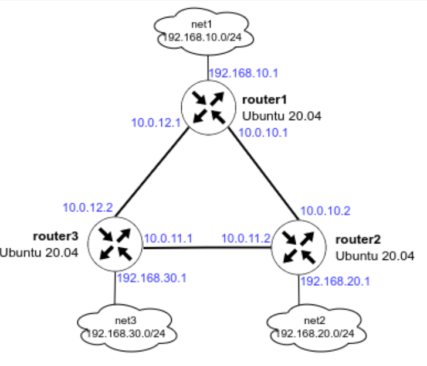
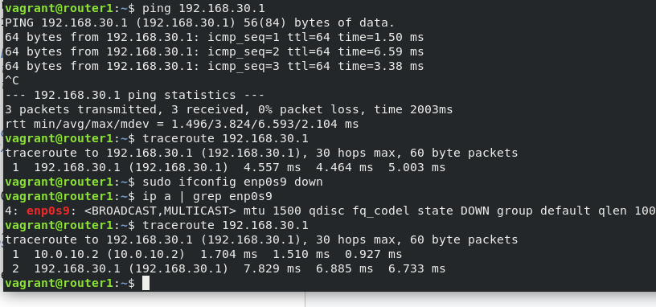
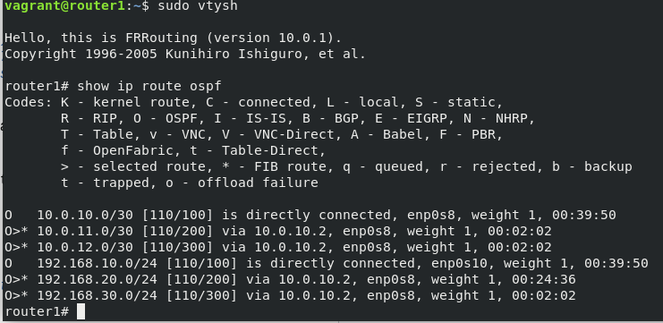
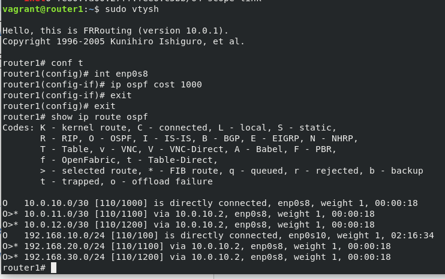
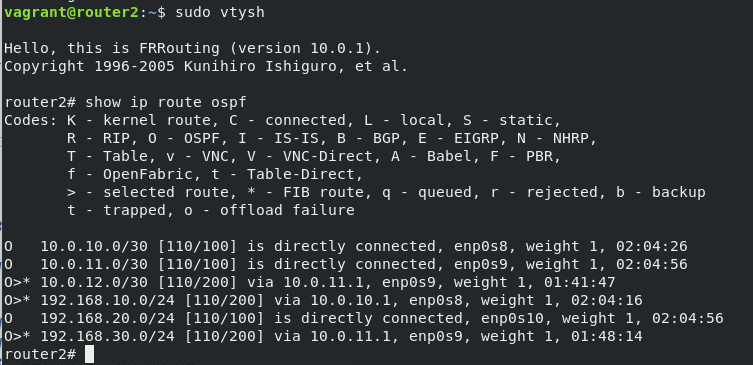
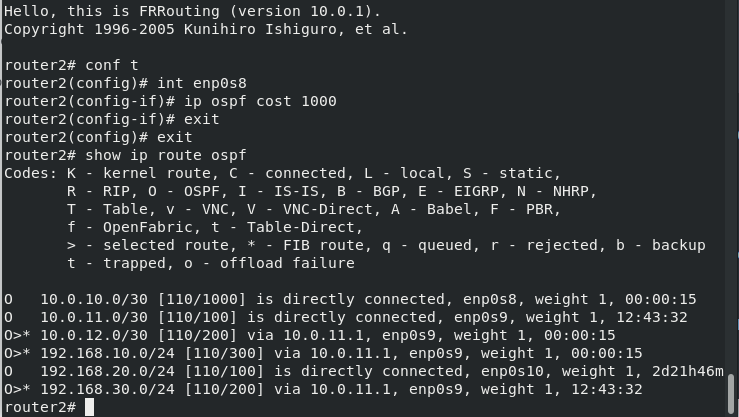

## Домашее задание № 21 OSPF

### Занятие 33. Статическая и динамическая маршрутизация,OSPF

#### Цель

Создать домашнюю сетевую лабораторию. Научится настраивать протокол OSPF в Linux-based системах.


#### Описание домашнего задания

1. Развернуть 3 виртуальные машины
2. Объединить их разными vlan
- настроить OSPF между машинами на базе Quagga;
- изобразить ассиметричный роутинг;
- сделать один из линков "дорогим", но что бы при этом роутинг был симметричным.


#### Ход работы
1. Разворачиваем 3 виртуальные машины

Так как мы планируем настроить OSPF, все 3 виртуальные машины должны быть соединены между собой (разными VLAN), а также иметь одну (или несколько) доолнительных сетей, к которым, далее OSPF сформирует маршруты. Исходя из данных требований, мы можем нарисовать топологию сети:


Создаём каталог, в котором будут храниться настройки виртуальной машины. В каталоге создаём файл с именем Vagrantfile.

После создания данного файла, из терминала идём в каталог, в котором лежит данный Vagrantfile и вводим команду vagrant up

Результатом выполнения данной команды будут 3 созданные виртуальные машины, которые соединены между собой сетями (10.0.10.0/30, 10.0.11.0/30 и 10.0.12.0/30). У каждого роутера есть дополнительная сеть:
на router1 — 192.168.10.0/24
на router2 — 192.168.20.0/24
на router3 — 192.168.30.0/24
На данном этапе ping до дополнительных сетей (192.168.10-30.0/24) с соседних роутеров будет недоступен. 

Для подключения к ВМ нужно ввести команду vagrant ssh <имя машины>, например vagrant ssh router1
Далее потребуется переключиться в root пользователя: sudo -i

#### Установка пакетов для тестирования и настройки OSPF

Перед настройкой FRR рекомендуется поставить базовые программы для изменения конфигурационных файлов (vim) и изучения сети (traceroute, tcpdump, net-tools):
```
apt update
apt install vim traceroute tcpdump net-tools
```
#### Настройка OSPF между машинами на базе Quagga

Процесс установки FRR и настройки OSPF вручную:
1) Отключаем файерволл ufw и удаляем его из автозагрузки:
```
   systemctl stop ufw 
   systemctl disable ufw
```
2) Добавляем gpg ключ:
```
   curl -s https://deb.frrouting.org/frr/keys.asc | sudo apt-key add -
```
3) Добавляем репозиторий c пакетом FRR:
   ```
   echo deb https://deb.frrouting.org/frr $(lsb_release -s -c) frr-stable > /etc/apt/sources.list.d/frr.list
   ```
4) Обновляем пакеты и устанавливаем FRR:
   ```
   sudo apt update
   sudo apt install frr frr-pythontools
   ```
5) Разрешаем (включаем) маршрутизацию транзитных пакетов:
```
sysctl net.ipv4.conf.all.forwarding=1
```
6) Включаем демон ospfd в FRR
Для этого открываем в редакторе файл /etc/frr/daemons и меняем в нём параметры для пакетов zebra и ospfd на yes:
```
vim /etc/frr/daemons

zebra=yes
ospfd=yes
bgpd=no
ospf6d=no
ripd=no
ripngd=no
isisd=no
pimd=no
ldpd=no
nhrpd=no
eigrpd=no
babeld=no
sharpd=no
pbrd=no
bfdd=no
fabricd=no
vrrpd=no
pathd=no
```

В примере показана только часть файла

7) Настройка OSPF
Для настройки OSPF нам потребуется создать файл /etc/frr/frr.conf который будет содержать в себе информацию о требуемых интерфейсах и OSPF. Разберем пример создания файла на хосте router1. 

Для начала нам необходимо узнать имена интерфейсов и их адреса. Сделать это можно с помощью двух способов:
```
Посмотреть в linux: ip a | grep inet 
root@router1:~# ip a | grep "inet " 
    inet 127.0.0.1/8 scope host lo
    inet 10.0.2.15/24 brd 10.0.2.255 scope global dynamic enp0s3
    inet 10.0.10.1/30 brd 10.0.10.3 scope global enp0s8
    inet 10.0.12.1/30 brd 10.0.12.3 scope global enp0s9
    inet 192.168.10.1/24 brd 192.168.10.255 scope global enp0s10
    inet 192.168.50.10/24 brd 192.168.50.255 scope global enp0s16
root@router1:~# 
```

Зайти в интерфейс FRR и посмотреть информацию об интерфейсах
```
root@router1:~# vtysh
Hello, this is FRRouting (version 8.1).
Copyright 1996-2005 Kunihiro Ishiguro, et al.

router1# show interface brief
Interface       Status  VRF             Addresses
---------       ------  ---             ---------
enp0s3          up      default         10.0.2.15/24
enp0s8          up      default         10.0.10.1/30
enp0s9          up      default         10.0.12.1/30
enp0s10         up      default         192.168.10.1/24
enp0s16         up      default         192.168.50.10/24
lo              up      default         

router1# exit 
root@router1:~# 
```

В обоих примерах мы увидем имена сетевых интерфейсов, их ip-адреса и маски подсети. Исходя из схемы мы понимаем, что для настройки OSPF нам достаточно описать интерфейсы enp0s8, enp0s9, enp0s10 

Создаём файл /etc/frr/frr.conf и вносим в него следующую информацию:

```
!Указание версии FRR
frr version 8.1
frr defaults traditional
!Указываем имя машины
hostname router1
log syslog informational
no ipv6 forwarding
service integrated-vtysh-config
!
!Добавляем информацию об интерфейсе enp0s8
interface enp0s8
 !Указываем имя интерфейса
 description r1-r2
 !Указываем ip-aдрес и маску (эту информацию мы получили в прошлом шаге)
 ip address 10.0.10.1/30
 !Указываем параметр игнорирования MTU
 ip ospf mtu-ignore
 !Если потребуется, можно указать «стоимость» интерфейса
 !ip ospf cost 1000
 !Указываем параметры hello-интервала для OSPF пакетов
 ip ospf hello-interval 10
 !Указываем параметры dead-интервала для OSPF пакетов
 !Должно быть кратно предыдущему значению
 ip ospf dead-interval 30
!
interface enp0s9
 description r1-r3
 ip address 10.0.12.1/30
 ip ospf mtu-ignore
 !ip ospf cost 45
 ip ospf hello-interval 10
 ip ospf dead-interval 30

interface enp0s10
 description net_router1
 ip address 192.168.10.1/24
 ip ospf mtu-ignore
 !ip ospf cost 45
 ip ospf hello-interval 10
 ip ospf dead-interval 30 
!
!Начало настройки OSPF
router ospf
 !Указываем router-id 
 router-id 1.1.1.1
 !Указываем сети, которые хотим анонсировать соседним роутерам
 network 10.0.10.0/30 area 0
 network 10.0.12.0/30 area 0
 network 192.168.10.0/24 area 0 
 !Указываем адреса соседних роутеров
 neighbor 10.0.10.2
 neighbor 10.0.12.2

!Указываем адрес log-файла
log file /var/log/frr/frr.log
default-information originate always
```

Сохраняем изменения и выходим из данного файла. 

Вместо файла frr.conf мы можем задать данные параметры вручную из vtysh. Vtysh использует cisco-like команды.

8) После создания файлов /etc/frr/frr.conf и /etc/frr/daemons нужно проверить, что владельцем файла является пользователь frr. Группа файла также должна быть frr. Должны быть установленны следующие права:
у владельца на чтение и запись
у группы только на чтение
```
ls -l /etc/frr
```
Если права или владелец файла указан неправильно, то нужно поменять владельца и назначить правильные права, например:
```
chown frr:frr /etc/frr/frr.conf 
chmod 640 /etc/frr/frr.conf 
```
9) Перезапускаем FRR и добавляем его в автозагрузку
```
   systemct restart frr 
   systemctl enable frr
```
10) Проверям, что OSPF перезапустился без ошибок
```
root@router1:~# systemctl status frr
● frr.service - FRRouting
     Loaded: loaded (/lib/systemd/system/frr.service; enabled; vendor preset: enabled)
     Active: active (running) since Sun 2024-07-21 15:25:36 UTC; 15s ago
       Docs: https://frrouting.readthedocs.io/en/latest/setup.html
   Main PID: 21755 (watchfrr)
     Status: "FRR Operational"
      Tasks: 10 (limit: 1117)
     Memory: 20.4M
     CGroup: /system.slice/frr.service
             ├─21755 /usr/lib/frr/watchfrr -d -F traditional zebra mgmtd ospfd staticd
             ├─21766 /usr/lib/frr/zebra -d -F traditional -A 127.0.0.1 -s 90000000
             ├─21771 /usr/lib/frr/mgmtd -d -F traditional -A 127.0.0.1
             ├─21773 /usr/lib/frr/ospfd -d -F traditional -A 127.0.0.1
             └─21776 /usr/lib/frr/staticd -d -F traditional -A 127.0.0.1

Jul 21 15:25:31 router1 ospfd[21773]: [VTVCM-Y2NW3] Configuration Read in Took: 00:00:00
Jul 21 15:25:31 router1 frrinit.sh[21783]: [21783|ospfd] Configuration file[/etc/frr/frr.conf] processi>
Jul 21 15:25:31 router1 watchfrr[21755]: [ZJW5C-1EHNT] restart all process 21756 exited with non-zero s>
Jul 21 15:25:36 router1 watchfrr[21755]: [QDG3Y-BY5TN] staticd state -> up : connect succeeded
Jul 21 15:25:36 router1 watchfrr[21755]: [QDG3Y-BY5TN] ospfd state -> up : connect succeeded
Jul 21 15:25:36 router1 watchfrr[21755]: [QDG3Y-BY5TN] mgmtd state -> up : connect succeeded
Jul 21 15:25:36 router1 watchfrr[21755]: [QDG3Y-BY5TN] zebra state -> up : connect succeeded
Jul 21 15:25:36 router1 watchfrr[21755]: [KWE5Q-QNGFC] all daemons up, doing startup-complete notify
Jul 21 15:25:36 router1 frrinit.sh[21736]:  * Started watchfrr
Jul 21 15:25:36 router1 systemd[1]: Started FRRouting.

```
Если мы правильно настроили OSPF, то с любого хоста нам должны быть доступны сети:
```
192.168.10.0/24
192.168.20.0/24
192.168.30.0/24
10.0.10.0/30 
10.0.11.0/30
10.0.13.0/30
```
Проверим доступность сетей с хоста router1:

- попробуем сделать ping до ip-адреса 192.168.30.1
- Запустим трассировку до адреса 192.168.30.1
- Попробуем отключить интерфейс enp0s9 и немного подождем и снова запустим трассировку до ip-адреса 192.168.30.1



Как мы видим, после отключения интерфейса сеть 192.168.30.0/24 нам остаётся доступна.

Также мы можем проверить из интерфейса vtysh какие маршруты мы видим на данный момент:



#### Настройка ассиметричного роутинга

Для настройки ассиметричного роутинга нам необходимо выключить блокировку ассиметричной маршрутизации: sysctl net.ipv4.conf.all.rp_filter=0

Далее, выбираем один из роутеров, на котором изменим «стоимость интерфейса». Например поменяем стоимость интерфейса enp0s8 на router1:





После внесения данных настроек, мы видим, что маршрут до сети 192.168.20.0/30  теперь пойдёт через router2, но обратный трафик от router2 пойдёт по другому пути. Давайте это проверим:
1) На router1 запускаем пинг от 192.168.10.1 до 192.168.20.1: 

```
ping -I 192.168.10.1 192.168.20.1
```
2) На router2 запускаем tcpdump, который будет смотреть трафик только на порту enp0s9:

```
vagrant@router2:~$ sudo tcpdump -i enp0s9
tcpdump: verbose output suppressed, use -v or -vv for full protocol decode
listening on enp0s9, link-type EN10MB (Ethernet), capture size 262144 bytes
12:35:22.258593 IP 192.168.10.1 > router2: ICMP echo request, id 15, seq 14, length 64
12:35:23.259328 IP 192.168.10.1 > router2: ICMP echo request, id 15, seq 15, length 64
12:35:23.718952 IP 10.0.11.1 > ospf-all.mcast.net: OSPFv2, Hello, length 48
12:35:24.260057 IP 192.168.10.1 > router2: ICMP echo request, id 15, seq 16, length 64
12:35:25.261076 IP 192.168.10.1 > router2: ICMP echo request, id 15, seq 17, length 64
12:35:26.351765 IP 192.168.10.1 > router2: ICMP echo request, id 15, seq 18, length 64
12:35:26.836477 IP router2 > ospf-all.mcast.net: OSPFv2, Hello, length 48
12:35:27.352276 IP 192.168.10.1 > router2: ICMP echo request, id 15, seq 19, length 64
12:35:28.358240 IP 192.168.10.1 > router2: ICMP echo request, id 15, seq 20, length 64
12:35:29.378296 IP 192.168.10.1 > router2: ICMP echo request, id 15, seq 21, length 64
12:35:30.381673 IP 192.168.10.1 > router2: ICMP echo request, id 15, seq 22, length 64
12:35:31.379672 IP 192.168.10.1 > router2: ICMP echo request, id 15, seq 23, length 64
^C
12 packets captured
12 packets received by filter
0 packets dropped by kernel

```

3) На router2 запускаем tcpdump, который будет смотреть трафик только на порту enp0s8:
```
vagrant@router2:~$ sudo tcpdump -i enp0s8
tcpdump: verbose output suppressed, use -v or -vv for full protocol decode
listening on enp0s8, link-type EN10MB (Ethernet), capture size 262144 bytes
14:28:51.305199 IP router2 > 192.168.10.1: ICMP echo reply, id 16, seq 12, length 64
14:28:52.307425 IP router2 > 192.168.10.1: ICMP echo reply, id 16, seq 13, length 64
14:28:52.771409 IP 10.0.10.1 > ospf-all.mcast.net: OSPFv2, Hello, length 48
14:28:52.859655 IP router2 > ospf-all.mcast.net: OSPFv2, Hello, length 48
14:28:53.308259 IP router2 > 192.168.10.1: ICMP echo reply, id 16, seq 14, length 64
14:28:54.309784 IP router2 > 192.168.10.1: ICMP echo reply, id 16, seq 15, length 64
14:28:55.311655 IP router2 > 192.168.10.1: ICMP echo reply, id 16, seq 16, length 64
14:28:56.312033 IP router2 > 192.168.10.1: ICMP echo reply, id 16, seq 17, length 64
14:28:57.313112 IP router2 > 192.168.10.1: ICMP echo reply, id 16, seq 18, length 64
14:28:58.315074 IP router2 > 192.168.10.1: ICMP echo reply, id 16, seq 19, length 64
14:28:59.315622 IP router2 > 192.168.10.1: ICMP echo reply, id 16, seq 20, length 64
14:29:00.318314 IP router2 > 192.168.10.1: ICMP echo reply, id 16, seq 21, length 64
^C
12 packets captured
12 packets received by filter
0 packets dropped by kernel

```

Видим что данный порт только отправляет ICMP-трафик на адрес 192.168.10.1

Таким образом мы видим ассиметричный роутинг.


#### Настройка симметичного роутинга

Так как у нас уже есть один «дорогой» интерфейс, нам потребуется добавить ещё один дорогой интерфейс, чтобы у нас перестала работать ассиметричная маршрутизация. 

Так как в прошлом задании мы заметили что router2 будет отправлять обратно трафик через порт enp0s8, мы также должны сделать его дорогим и далее проверить, что теперь используется симметричная маршрутизация:

Поменяем стоимость интерфейса enp0s8 на router2:



После внесения данных настроек, мы видим, что маршрут до сети 192.168.10.0/30  пойдёт через router2.

Давайте это проверим:
1) На router1 запускаем пинг от 192.168.10.1 до 192.168.20.1: 
```
ping -I 192.168.10.1 192.168.20.1
```

2) На router2 запускаем tcpdump, который будет смотреть трафик только на порту enp0s9:

```
vagrant@router2:~$ sudo tcpdump -i enp0s9
tcpdump: verbose output suppressed, use -v or -vv for full protocol decode
listening on enp0s9, link-type EN10MB (Ethernet), capture size 262144 bytes
16:58:21.880296 IP 192.168.10.1 > router2: ICMP echo request, id 17, seq 18, length 64
16:58:21.880374 IP router2 > 192.168.10.1: ICMP echo reply, id 17, seq 18, length 64
16:58:22.881884 IP 192.168.10.1 > router2: ICMP echo request, id 17, seq 19, length 64
16:58:22.881972 IP router2 > 192.168.10.1: ICMP echo reply, id 17, seq 19, length 64
16:58:23.882035 IP 192.168.10.1 > router2: ICMP echo request, id 17, seq 20, length 64
16:58:23.882163 IP router2 > 192.168.10.1: ICMP echo reply, id 17, seq 20, length 64
16:58:24.882204 IP 192.168.10.1 > router2: ICMP echo request, id 17, seq 21, length 64
16:58:24.882284 IP router2 > 192.168.10.1: ICMP echo reply, id 17, seq 21, length 64
16:58:25.883007 IP 192.168.10.1 > router2: ICMP echo request, id 17, seq 22, length 64
16:58:25.883113 IP router2 > 192.168.10.1: ICMP echo reply, id 17, seq 22, length 64
16:58:26.884147 IP 192.168.10.1 > router2: ICMP echo request, id 17, seq 23, length 64
16:58:26.884232 IP router2 > 192.168.10.1: ICMP echo reply, id 17, seq 23, length 64
^C
12 packets captured
12 packets received by filter
0 packets dropped by kernel

```