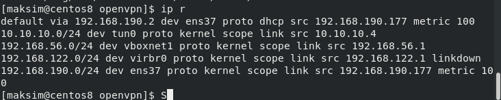

## Домашее задание № 22 VPN

### Занятие 35. Мосты, туннели и VPN

#### Цель

Создать домашнюю сетевую лабораторию. Научится настраивать VPN-сервер в Linux-based системах.

#### Описание домашнего задания

1. Настроить VPN между двумя ВМ в tun/tap режимах, замерить скорость в туннелях, сделать вывод об отличающихся показателях
2. Поднять RAS на базе OpenVPN с клиентскими сертификатами, подключиться с локальной машины на ВМ
3. (*) Самостоятельно изучить и настроить ocserv, подключиться с хоста к ВМ


#### Ход работы

#### TUN/TAP режимы VPN

Для выполнения первого пункта необходимо написать Vagrantfile, который будет поднимать 2 виртуальные машины server и client. 

После запуска машин из Vagrantfile необходимо выполнить следующие действия на server и client машинах:

```
# Устанавливаем нужные пакеты и отключаем SELinux  
apt update
apt install openvpn iperf3 selinux-utils
setenforce 0
```

Настройка хоста 1 (server.loc):

```
# Cоздаем файл-ключ 
       openvpn --genkey secret /etc/openvpn/static.key
   # Cоздаем конфигурационный файл OpenVPN 
   vim /etc/openvpn/server.conf
   
   # Содержимое файла server.conf
   dev tap 
ifconfig 10.10.10.1 255.255.255.0 
topology subnet 
secret /etc/openvpn/static.key 
comp-lzo 
status /var/log/openvpn-status.log 
log /var/log/openvpn.log  
verb 3 
     # Создаем service unit для запуска OpenVPN
     vim /etc/systemd/system/openvpn@.service
     # Содержимое файла-юнита
[Unit] 
Description=OpenVPN Tunneling Application On %I 
After=network.target 
[Service] 
Type=notify 
PrivateTmp=true 
ExecStart=/usr/sbin/openvpn --cd /etc/openvpn/ --config %i.conf 
[Install] 
WantedBy=multi-user.target
     # Запускаем сервис 
systemctl start openvpn@server 
systemctl enable openvpn@server
```

Настройка хоста 2(client.loc):

```
# Cоздаем конфигурационный файл OpenVPN 
vim /etc/openvpn/server.conf

# Содержимое конфигурационного файла  
dev tap 
remote 192.168.56.10 
ifconfig 10.10.10.2 255.255.255.0 
topology subnet 
route 192.168.56.0 255.255.255.0 
secret /etc/openvpn/static.key
comp-lzo
status /var/log/openvpn-status.log 
log /var/log/openvpn.log 
verb 3 
``` 

На хост 2 в директорию /etc/openvpn необходимо скопировать файл-ключ static.key, который был создан на хосте 1.  

```
# Создаем service unit для запуска OpenVPN
     vim /etc/systemd/system/openvpn@.service
     # Содержимое файла-юнита
[Unit] 
Description=OpenVPN Tunneling Application On %I 
After=network.target 
[Service] 
Type=notify 
PrivateTmp=true 
ExecStart=/usr/sbin/openvpn --cd /etc/openvpn/ --config %i.conf 
[Install] 
WantedBy=multi-user.target
     # Запускаем сервис 
systemctl start openvpn@server 
systemctl enable openvpn@server

```

Далее необходимо замерить скорость в туннеле: 

На хосте 1 запускаем iperf3 в режиме сервера: iperf3 -s & 
На хосте 2 запускаем iperf3 в режиме клиента и замеряем  скорость в туннеле: iperf3 -c 10.10.10.1 -t 40 -i 5
```
vagrant@client:~$ iperf3 -c 10.10.10.1 -t 40 -i 5
Connecting to host 10.10.10.1, port 5201
[  5] local 10.10.10.2 port 43044 connected to 10.10.10.1 port 5201
[ ID] Interval           Transfer     Bitrate         Retr  Cwnd
[  5]   0.00-5.00   sec  10.7 MBytes  17.9 Mbits/sec   88    313 KBytes       
[  5]   5.00-10.00  sec  12.0 MBytes  20.1 Mbits/sec   95    121 KBytes       
[  5]  10.00-15.00  sec  17.5 MBytes  29.3 Mbits/sec   32    115 KBytes       
[  5]  15.00-20.00  sec  13.0 MBytes  21.9 Mbits/sec   32    103 KBytes       
[  5]  20.00-25.00  sec  12.3 MBytes  20.6 Mbits/sec    0    164 KBytes       
[  5]  25.00-30.00  sec  14.6 MBytes  24.5 Mbits/sec   52    112 KBytes       
[  5]  30.00-35.00  sec  14.8 MBytes  24.9 Mbits/sec    5    123 KBytes       
[  5]  35.00-40.00  sec  14.0 MBytes  23.4 Mbits/sec    4    128 KBytes       
- - - - - - - - - - - - - - - - - - - - - - - - -
[ ID] Interval           Transfer     Bitrate         Retr
[  5]   0.00-40.00  sec   109 MBytes  22.8 Mbits/sec  308             sender
[  5]   0.00-40.06  sec   108 MBytes  22.6 Mbits/sec                  receiver

iperf Done.

```

Повторяем пункты 1-2 для режима работы tun. 
```
vagrant@client:~$ iperf3 -c 10.10.10.1 -t 40 -i 5
Connecting to host 10.10.10.1, port 5201
[  5] local 10.10.10.2 port 52588 connected to 10.10.10.1 port 5201
[ ID] Interval           Transfer     Bitrate         Retr  Cwnd
[  5]   0.00-5.00   sec  16.1 MBytes  26.9 Mbits/sec   25    180 KBytes       
[  5]   5.00-10.00  sec  17.5 MBytes  29.4 Mbits/sec   26    135 KBytes       
[  5]  10.00-15.00  sec  13.9 MBytes  23.4 Mbits/sec   16    126 KBytes       
[  5]  15.00-20.00  sec  13.4 MBytes  22.4 Mbits/sec   15    116 KBytes       
[  5]  20.00-25.00  sec  15.8 MBytes  26.5 Mbits/sec    7    128 KBytes       
[  5]  25.00-30.00  sec  12.8 MBytes  21.5 Mbits/sec   14    149 KBytes       
[  5]  30.00-35.01  sec  11.0 MBytes  18.5 Mbits/sec   16    115 KBytes       
[  5]  35.01-40.00  sec  13.0 MBytes  21.8 Mbits/sec    8    118 KBytes       
- - - - - - - - - - - - - - - - - - - - - - - - -
[ ID] Interval           Transfer     Bitrate         Retr
[  5]   0.00-40.00  sec   114 MBytes  23.8 Mbits/sec  127             sender
[  5]   0.00-40.06  sec   113 MBytes  23.7 Mbits/sec                  receiver

iperf Done.

```

TAP эмулирует Ethernet-устройство и работает на канальном уровне модели OSI, оперируя кадрами Ethernet. TUN (сетевой туннель) работает на сетевом уровне модели OSI, оперируя IP-пакетами. TAP используется для создания сетевого моста, тогда как TUN — для маршрутизации. 

По замерению скорости tun бустрее tap.

Отличие интерфейсов tun и tap заключается в том, что tap старается больше походить на реальный сетевой интерфейс, а именно он позволяет себе принимать и отправлять ARP запросы, обладает MAC адресом и может являться одним из интерфейсов сетевого моста, так как он обладает полной поддержкой ethernet - протокола канального уровня (уровень 2). Интерфейс tun этой поддержки лишен, поэтому он может принимать и отправлять только IP пакеты и никак не ethernet кадры. Он не обладает MAC-адресом и не может быть добавлен в бридж. Зато он более легкий и быстрый за счет отсутствия дополнительной инкапсуляции и прекрасно подходит для тестирования сетевого стека или построения виртуальных частных сетей (VPN).

#### RAS на базе OpenVPN 

Для выполнения данного задания можно воспользоваться Vagrantfile из  1 задания, только убрать одну ВМ. После запуска отключаем SELinux 
(setenforce 0) или создаём правило для него. 

Настройка сервера:

```
# Устанавливаем необходимые пакеты 
apt update
   apt install openvpn easy-rsa

# Переходим в директорию /etc/openvpn и инициализируем PKI
cd /etc/openvpn
/usr/share/easy-rsa/easyrsa init-pki
# Генерируем необходимые ключи и сертификаты для сервера 
echo 'rasvpn' | /usr/share/easy-rsa/easyrsa gen-req server nopass
echo 'yes' | /usr/share/easy-rsa/easyrsa sign-req server server 
/usr/share/easy-rsa/easyrsa gen-dh
openvpn --genkey secret ca.key

# Генерируем необходимые ключи и сертификаты для клиента
echo 'client' | /usr/share/easy-rsa/easyrsa gen-req client nopass
echo 'yes' | /usr/share/easy-rsa/easyrsa sign-req client client

# Создаем конфигурационный файл сервера 
vim /etc/openvpn/server.conf

# Зададим параметр iroute для клиента
echo 'iroute 10.10.10.0 255.255.255.0' > /etc/openvpn/client/client

# Содержимое файла server.conf
port 1207 
proto udp 
dev tun 
ifconfig 10.10.10.1 255.255.255.0
topology subnet
ca /etc/openvpn/pki/ca.crt 
cert /etc/openvpn/pki/issued/server.crt 
key /etc/openvpn/pki/private/server.key 
dh /etc/openvpn/pki/dh.pem 
server 10.10.10.0 255.255.255.0 
ifconfig-pool-persist ipp.txt 
client-to-client 
client-config-dir /etc/openvpn/client 
keepalive 10 120 
comp-lzo 
persist-key 
persist-tun 
status /var/log/openvpn-status.log 
log /var/log/openvpn.log 
verb 3


# Запускаем сервис (при необходимости создать файл юнита как в задании 1) 
systemctl start openvpn@server
systemctl enable openvpn@server

```


На хост-машине: 

1) Необходимо создать файл client.conf со следующим содержимым: 

```
dev tun 
proto udp 
remote 192.168.56.10 1207 
client 
resolv-retry infinite 
remote-cert-tls server 
ca ./ca.crt 
cert ./client.crt 
key ./client.key 
route 192.168.56.0 255.255.255.0 
persist-key 
persist-tun 
comp-lzo 
verb 3 
```

2) Скопировать в одну директорию с client.conf файлы с сервера: 
```        
/etc/openvpn/pki/ca.crt 
/etc/openvpn/pki/issued/client.crt 
/etc/openvpn/pki/private/client.key
```

Далее можно проверить подключение с помощью: openvpn --config client.conf


При успешном подключении проверяем пинг по внутреннему IP адресу  сервера в туннеле: ping -c 4 10.10.10.1 


Также проверяем командой ip r (netstat -rn) на хостовой машине что сеть туннеля импортирована в таблицу маршрутизации. 


