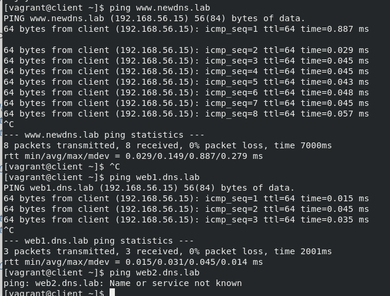
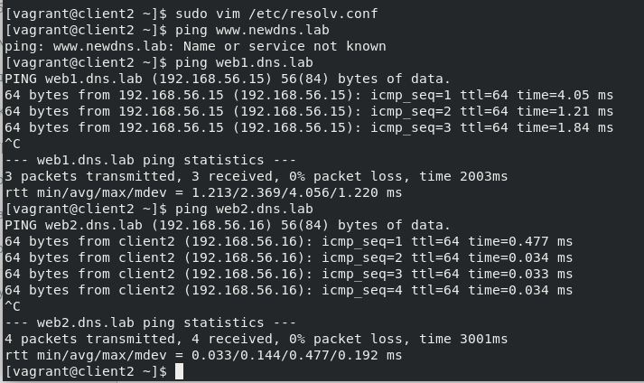

## Домашее задание № 23 DNS

### Занятие 36. DNS- настройка и обслуживание

#### Цель

Создать домашнюю сетевую лабораторию. Изучить основы DNS, научиться работать с технологией Split-DNS в Linux-based системах

#### Описание домашнего задания

1. взять стенд https://github.com/erlong15/vagrant-bind 
добавить еще один сервер client2
завести в зоне dns.lab имена:
web1 - смотрит на клиент1
web2  смотрит на клиент2
завести еще одну зону newdns.lab
завести в ней запись
www - смотрит на обоих клиентов

2. настроить split-dns
клиент1 - видит обе зоны, но в зоне dns.lab только web1
клиент2 видит только dns.lab

Дополнительное задание
* настроить все без выключения selinux

#### Ход работы

1. Работа со стендом и настройка DNS

Скачаем себе стенд https://github.com/erlong15/vagrant-bind, перейдём в скаченный каталог и изучим содержимое файлов:

```
➜  git clone https://github.com/erlong15/vagrant-bind.git
➜  cd vagrant-bind 
➜  vagrant-bind  ls -l 
total 12
drwxrwxr-x 2 alex alex 4096 мар 22 18:03 provisioning
-rw-rw-r-- 1 alex alex  414 мар 22 18:03 README.md
-rw-rw-r-- 1 alex alex  820 мар 22 18:03 Vagrantfile
```

Мы увидем файл Vagrantfile. Откроем его в любом, удобном для вас текстовом редакторе и добавим необходимую ВМ:
```
 config.vm.define "client2" do |client2|
    client2.vm.network "private_network", ip: "192.168.50.16", virtualbox__intnet: "dns"
    client2.vm.hostname = "client2"
  end

```

2. Работа с Ansible

Ansible файлы приводятся в соответствии с методическими рекомендациями.

3. Настройка Split-DNS

У нас уже есть прописанные зоны dns.lab и newdns.lab. Однако по заданию client1  должен видеть запись web1.dns.lab и не видеть запись web2.dns.lab. Client2 может видеть обе записи из домена dns.lab, но не должен видеть записи домена newdns.lab Осуществить данные настройки нам поможет технология Split-DNS.  

1) Создать дополнительный файл зоны dns.lab, в котором будет прописана только одна запись: vim /etc/named/named.dns.lab.client

2) Внести изменения в файл /etc/named.conf на хостах ns01 и ns02

Прежде всего нужно сделать access листы для хостов client и client2. Сначала сгенерируем ключи для хостов client и client2, для этого на хосте ns01 запустим утилиту tsig-keygen (ключ может генериться 5 минут и более): 

Технология Split-DNS реализуется с помощью описания представлений (view), для каждого отдельного acl. В каждое представление (view) добавляются только те зоны, которые разрешено видеть хостам, адреса которых указаны в access листе.

Все ранее описанные зоны должны быть перенесены в модули view. Вне view зон быть недолжно, зона any должна всегда находиться в самом низу. 

Далее внесем изменения в файл /etc/named.conf на сервере ns02. Файл будет похож на файл, лежащий на ns01, только в настройках будет указание забирать информацию с сервера ns01:

Далее, нужно будет проверить работу Split-DNS с хостов client и client2. Для проверки можно использовать утилиту ping:

Проверка на client:



На хосте мы видим, что client видит обе зоны (dns.lab и newdns.lab), однако информацию о хосте web2.dns.lab он получить не может. 

Проверка на client2: 



