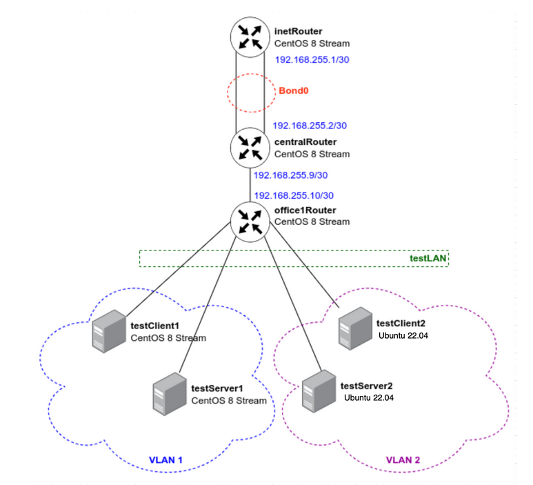
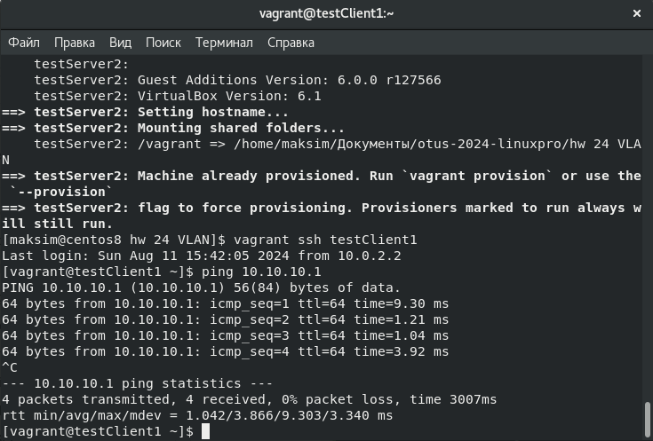
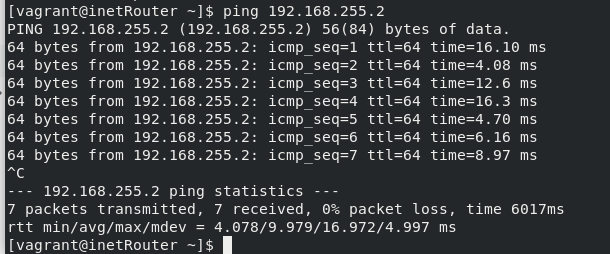
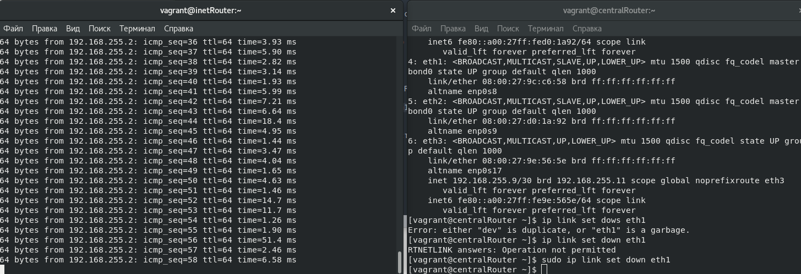

## Домашее задание № 24 VLAN

### Занятие 37. Сетевые пакеты. VLAN'ы,LACP_Строим бонды и вланы

#### Цель

Научиться настраивать VLAN и LACP. 

#### Описание домашнего задания

в Office1 в тестовой подсети появляется сервера с доп интерфейсами и адресами
в internal сети testLAN: 
- testClient1 - 10.10.10.254
- testClient2 - 10.10.10.254
- testServer1- 10.10.10.1 
- testServer2- 10.10.10.1

Равести вланами:
testClient1 <-> testServer1
testClient2 <-> testServer2



Между centralRouter и inetRouter "пробросить" 2 линка (общая inernal сеть) и объединить их в бонд, проверить работу c отключением интерфейсов

#### Ход работы

#### Настройка VLAN на хостах

На хосте testClient1 требуется создать файл /etc/sysconfig/network-scripts/ifcfg-vlan1 со следующим параметрами:

```
VLAN=yes
#Тип интерфейса - VLAN
TYPE=Vlan
#Указываем физическое устройство, через которые будет работать VLAN
PHYSDEV=eth1
#Указываем номер VLAN (VLAN_ID)
VLAN_ID=1
VLAN_NAME_TYPE=DEV_PLUS_VID_NO_PAD
PROXY_METHOD=none
BROWSER_ONLY=no
BOOTPROTO=none
#Указываем IP-адрес интерфейса
IPADDR=10.10.10.254
#Указываем префикс (маску) подсети
PREFIX=24
#Указываем имя vlan
NAME=vlan1
#Указываем имя подинтерфейса
DEVICE=eth1.1
ONBOOT=yes
```

На хосте testServer1 создадим идентичный файл с другим IP-адресом (10.10.10.1).

После создания файлов нужно перезапустить сеть на обоих хостах:
systemctl restart NetworkManager

Проверим настройку интерфейса, если настройка произведена правильно, то с хоста testClient1 будет проходить ping до хоста testServer1:



Настройка VLAN на Ubuntu:

На хосте testClient2 требуется создать файл /etc/netplan/50-cloud-init.yaml со следующим параметрами:
```

# This file is generated from information provided by the datasource.  Changes
# to it will not persist across an instance reboot.  To disable cloud-init's
# network configuration capabilities, write a file
# /etc/cloud/cloud.cfg.d/99-disable-network-config.cfg with the following:
# network: {config: disabled}
network:
    version: 2
    ethernets:
        enp0s3:
            dhcp4: true
        #В разделе ethernets добавляем порт, на котором будем настраивать VLAN
        enp0s8: {}
    #Настройка VLAN
    vlans:
        #Имя VLANа
        vlan2:
          #Указываем номер VLAN`а
          id: 2
          #Имя физического интерфейса
          link: enp0s8
          #Отключение DHCP-клиента
          dhcp4: no
          #Указываем ip-адрес
          addresses: [10.10.10.254/24]

```

На хосте testServer2 создадим идентичный файл с другим IP-адресом (10.10.10.1).

После создания файлов нужно перезапустить сеть на обоих хостах: netplan apply

После настройки второго VLAN`а ping должен работать между хостами testClient1, testServer1 и между хостами testClient2, testServer2.

Примечание: до остальных хостов ping работать не будет, так как не настроена маршрутизация. 

#### Настройка LACP между хостами inetRouter и centralRouter

Bond интерфейс будет работать через порты eth1 и eth2. 

1) Изначально необходимо на обоих хостах добавить конфигурационные файлы для интерфейсов eth1 и eth2:

```
vim /etc/sysconfig/network-scripts/ifcfg-eth1

#Имя физического интерфейса
DEVICE=eth1
#Включать интерфейс при запуске системы
ONBOOT=yes
#Отключение DHCP-клиента
BOOTPROTO=none
#Указываем, что порт часть bond-интерфейса
MASTER=bond0
#Указываем роль bond
SLAVE=yes
NM_CONTROLLED=yes
USERCTL=no

```

У интерфейса ifcfg-eth2 идентичный конфигурационный файл, в котором нужно изменить имя интерфейса. 

2) После настройки интерфейсов eth1 и eth2 нужно настроить bond-интерфейс, для этого создадим файл /etc/sysconfig/network-scripts/

```
ifcfg-bond0

vim /etc/sysconfig/network-scripts/ifcfg-bond0

DEVICE=bond0
NAME=bond0
#Тип интерфейса — bond
TYPE=Bond
BONDING_MASTER=yes
#Указаваем IP-адрес 
IPADDR=192.168.255.1
#Указываем маску подсети
NETMASK=255.255.255.252
ONBOOT=yes
BOOTPROTO=static
#Указываем режим работы bond-интерфейса Active-Backup
# fail_over_mac=1 — данная опция «разрешает отвалиться» одному интерфейсу
BONDING_OPTS="mode=1 miimon=100 fail_over_mac=1"
NM_CONTROLLED=yes
```

После создания данных конфигурационных файлов необходимо перезапустить сеть:
systemctl restart NetworkManager

На некоторых версиях RHEL/CentOS перезапуск сетевого интерфейса не запустит bond-интерфейс, в этом случае рекомендуется перезапустить хост.

После настройки агрегации портов, необходимо проверить работу bond-интерфейса, для этого, на хосте inetRouter (192.168.255.1) запустим ping до centralRouter (192.168.255.2):



Не отменяя ping подключаемся к хосту centralRouter и выключаем там интерфейс eth1: 
```
[root@centralRouter ~]# ip link set down eth1
```



После данного действия ping не должен пропасть, так как трафик пойдёт по-другому порту.

