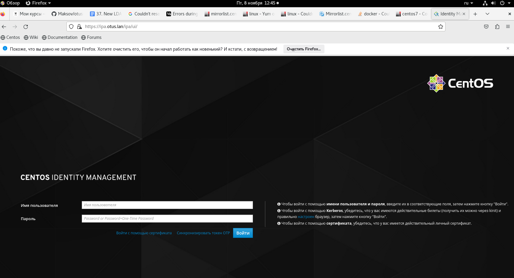
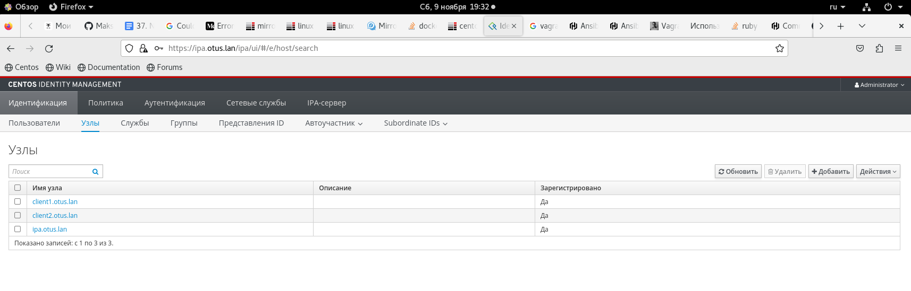

## Домашее задание № 25 LDAP

### 38. LDAP. Централизованная авторизация и аутентификация

#### Цель

Научиться настраивать LDAP-сервер и подключать к нему LDAP-клиентов

#### Описание домашнего задания

1) Установить FreeIPA
2) Написать Ansible-playbook для конфигурации клиента

Дополнительное задание
3)* Настроить аутентификацию по SSH-ключам
4)** Firewall должен быть включен на сервере и на клиенте


#### Ход работы


Создадим Vagrantfile, в котором будут указаны параметры наших ВМ:

```
Vagrant.configure("2") do |config|
    # Указываем ОС, версию, количество ядер и ОЗУ
    config.vm.box = "centos/stream8"
    config.vm.box_version = "20210210.0"
 
    config.vm.provider :virtualbox do |v|
      v.memory = 2048
      v.cpus = 1
    end
  
    # Указываем имена хостов и их IP-адреса
    boxes = [
      { :name => "ipa.otus.lan",
        :ip => "192.168.57.10",
      },
      { :name => "client1.otus.lan",
        :ip => "192.168.57.11",
      },
      { :name => "client2.otus.lan",
        :ip => "192.168.57.12",
      }
    ]
    # Цикл запуска виртуальных машин
    boxes.each do |opts|
      config.vm.define opts[:name] do |config|
        config.vm.hostname = opts[:name]
        config.vm.network "private_network", ip: opts[:ip]
      end
    end
  end
```

#### Установка FreeIPA сервера

Для начала нам необходимо настроить FreeIPA-сервер. Подключимся к нему по SSH с помощью команды: vagrant ssh ipa.otus.lan и перейдём в root-пользователя: sudo -i 

Начнем настройку FreeIPA-сервера: 
- Установим часовой пояс: timedatectl set-timezone Europe/Moscow
- Установим утилиту chrony: yum install -y chrony
- Запустим chrony и добавим его в автозагрузку: systemctl enable chronyd —now
- Если требуется, поменяем имя нашего сервера: hostnamectl set-hostname <имя сервера>
В нашей лабораторной работе данного действия не требуется, так как уже указаны корректные имена в Vagrantfile
- Выключим Firewall: systemctl stop firewalld
- Отключаем автозапуск Firewalld: systemctl disable firewalld
- Остановим Selinux: setenforce 0
- Поменяем в файле /etc/selinux/config, параметр Selinux на disabled

vi /etc/selinux/config

```
# This file controls the state of SELinux on the system.
# SELINUX= can take one of these three values:
#     enforcing - SELinux security policy is enforced.
#     permissive - SELinux prints warnings instead of enforcing.
#     disabled - No SELinux policy is loaded.
SELINUX=disabled
# SELINUXTYPE= can take one of these three values:
#     targeted - Targeted processes are protected,
#     minimum - Modification of targeted policy. Only selected processes are protected. 
#     mls - Multi Level Security protection.
SELINUXTYPE=targeted
```
- Для дальнейшей настройки FreeIPA нам потребуется, чтобы DNS-сервер хранил запись о нашем LDAP-сервере. В рамках данной лабораторной работы мы не будем настраивать отдельный DNS-сервер и просто добавим запись в файл /etc/hosts

vi /etc/hosts

```
127.0.0.1   localhost localhost.localdomain 
127.0.1.1 ipa.otus.lan ipa
192.168.57.10 ipa.otus.lan ipa
```

- Установим модуль DL1: yum install -y @idm:DL1
- Установим FreeIPA-сервер: yum install -y ipa-server

- Запустим скрипт установки: ipa-server-install
Далее, нам потребуется указать параметры нашего LDAP-сервера, после ввода каждого параметра нажимаем Enter, если нас устраивает параметр, указанный в квадратных скобках, то можно сразу нажимать Enter:

Do you want to configure integrated DNS (BIND)? [no]: no
Server host name [ipa.otus.lan]: <Нажимаем Enter>
Please confirm the domain name [otus.lan]: <Нажимем Enter>
Please provide a realm name [OTUS.LAN]: <Нажимаем Enter>
Directory Manager password: <Указываем пароль минимум 8 символов>
Password (confirm): <Дублируем указанный пароль>
IPA admin password: <Указываем пароль минимум 8 символов>
Password (confirm): <Дублируем указанный пароль>
NetBIOS domain name [OTUS]: <Нажимаем Enter>
Do you want to configure chrony with NTP server or pool address? [no]: no
The IPA Master Server will be configured with:
Hostname:       ipa.otus.lan
IP address(es): 192.168.57.10
Domain name:    otus.lan
Realm name:     OTUS.LAN

The CA will be configured with:
Subject DN:   CN=Certificate Authority,O=OTUS.LAN
Subject base: O=OTUS.LAN
Chaining:     self-signed
Проверяем параметры, если всё устраивает, то нажимаем yes
Continue to configure the system with these values? [no]: yes


Далее начнется процесс установки. Процесс установки занимает примерно 10-15 минут (иногда время может быть другим). Если мастер успешно выполнит настройку FreeIPA то в конце мы получим сообщение: 
The ipa-server-install command was successful

При вводе параметров установки мы вводили 2 пароля:

Directory Manager password — это пароль администратора сервера каталогов, У этого пользователя есть полный доступ к каталогу.
IPA admin password — пароль от пользователя FreeIPA admin

После успешной установки FreeIPA, проверим, что сервер Kerberos может выдать нам билет: 

```
[root@ipa ~]# kinit admin
Password for admin@OTUS.LAN: 
[root@ipa ~]# klist
Ticket cache: KCM:0
Default principal: admin@OTUS.LAN

Valid starting     Expires            Service principal
11/08/24 11:18:45  11/09/24 10:56:48  krbtgt/OTUS.LAN@OTUS.LAN
[root@ipa ~]# kdestroy
[root@ipa ~]# 

```
Мы можем зайти в Web-интерфейс нашего FreeIPA-сервера, для этого на нашей хостой машине нужно прописать следующую строку в файле Hosts:
192.168.57.10 ipa.otus.lan



#### Ansible playbook для конфигурации клиента

Настройка клиента похожа на настройку сервера. На хосте также нужно:
Настроить синхронизацию времени и часовой пояс
Настроить (или отключить) firewall
Настроить (или отключить) SElinux
В файле hosts должна быть указана запись с FreeIPA-сервером и хостом

Хостов, которые требуется добавить к серверу может быть много, для упрощения нашей работы выполним настройки с помощью Ansible

```
changed: [client2.otus.lan] => {
    "changed": true,
    "cmd": "echo -e \"yes\\nyes\" | ipa-client-install --mkhomedir --domain=OTUS.LAN --server=ipa.otus.lan --no-ntp -p admin -w C7Nyy5Z4",
    "delta": "0:01:29.988483",
    "end": "2024-11-09 18:13:19.232103",
    "invocation": {
        "module_args": {
            "_raw_params": "echo -e \"yes\\nyes\" | ipa-client-install --mkhomedir --domain=OTUS.LAN --server=ipa.otus.lan --no-ntp -p admin -w C7Nyy5Z4",
            "_uses_shell": true,
            "argv": null,
            "chdir": null,
            "creates": null,
            "executable": null,
            "removes": null,
            "stdin": null,
            "stdin_add_newline": true,
            "strip_empty_ends": true,
            "warn": false
        }
    },
    "msg": "",
    "rc": 0,
    "start": "2024-11-09 18:11:49.243620",
    "stderr": "Autodiscovery of servers for failover cannot work with this configuration.\nIf you proceed with the installation, services will be configured to always access the discovered server for all operations and will not fail over to other servers in case of failure.\nClient hostname: client2.otus.lan\nRealm: OTUS.LAN\nDNS Domain: otus.lan\nIPA Server: ipa.otus.lan\nBaseDN: dc=otus,dc=lan\nSkipping chrony configuration\nSuccessfully retrieved CA cert\n    Subject:     CN=Certificate Authority,O=OTUS.LAN\n    Issuer:      CN=Certificate Authority,O=OTUS.LAN\n    Valid From:  2024-11-08 05:53:17\n    Valid Until: 2044-11-08 05:53:17\n\nEnrolled in IPA realm OTUS.LAN\nCreated /etc/ipa/default.conf\nConfigured /etc/sssd/sssd.conf\nSystemwide CA database updated.\nHostname (client2.otus.lan) does not have A/AAAA record.\nFailed to update DNS records.\nMissing A/AAAA record(s) for host client2.otus.lan: 192.168.57.12.\nMissing reverse record(s) for address(es): 192.168.57.12.\nAdding SSH public key from /etc/ssh/ssh_host_ed25519_key.pub\nAdding SSH public key from /etc/ssh/ssh_host_ecdsa_key.pub\nAdding SSH public key from /etc/ssh/ssh_host_rsa_key.pub\nCould not update DNS SSHFP records.\nSSSD enabled\nConfigured /etc/openldap/ldap.conf\nConfigured /etc/ssh/ssh_config\nConfigured /etc/ssh/sshd_config\nConfiguring otus.lan as NIS domain.\nConfigured /etc/krb5.conf for IPA realm OTUS.LAN\nClient configuration complete.\nThe ipa-client-install command was successful",
    "stderr_lines": [
        "Autodiscovery of servers for failover cannot work with this configuration.",
        "If you proceed with the installation, services will be configured to always access the discovered server for all operations and will not fail over to other servers in case of failure.",
        "Client hostname: client2.otus.lan",
        "Realm: OTUS.LAN",
        "DNS Domain: otus.lan",
        "IPA Server: ipa.otus.lan",
        "BaseDN: dc=otus,dc=lan",
        "Skipping chrony configuration",
        "Successfully retrieved CA cert",
        "    Subject:     CN=Certificate Authority,O=OTUS.LAN",
        "    Issuer:      CN=Certificate Authority,O=OTUS.LAN",
        "    Valid From:  2024-11-08 05:53:17",
        "    Valid Until: 2044-11-08 05:53:17",
        "",
        "Enrolled in IPA realm OTUS.LAN",
        "Created /etc/ipa/default.conf",
        "Configured /etc/sssd/sssd.conf",
        "Systemwide CA database updated.",
        "Hostname (client2.otus.lan) does not have A/AAAA record.",
        "Failed to update DNS records.",
        "Missing A/AAAA record(s) for host client2.otus.lan: 192.168.57.12.",
        "Missing reverse record(s) for address(es): 192.168.57.12.",
        "Adding SSH public key from /etc/ssh/ssh_host_ed25519_key.pub",
        "Adding SSH public key from /etc/ssh/ssh_host_ecdsa_key.pub",
        "Adding SSH public key from /etc/ssh/ssh_host_rsa_key.pub",
        "Could not update DNS SSHFP records.",
        "SSSD enabled",
        "Configured /etc/openldap/ldap.conf",
        "Configured /etc/ssh/ssh_config",
        "Configured /etc/ssh/sshd_config",
        "Configuring otus.lan as NIS domain.",
        "Configured /etc/krb5.conf for IPA realm OTUS.LAN",
        "Client configuration complete.",
        "The ipa-client-install command was successful"
    ],
    "stdout": "This program will set up IPA client.\nVersion 4.9.13\n\nProceed with fixed values and no DNS discovery? [no]: \nContinue to configure the system with these values? [no]: ",
    "stdout_lines": [
        "This program will set up IPA client.",
        "Version 4.9.13",
        "",
        "Proceed with fixed values and no DNS discovery? [no]: ",
        "Continue to configure the system with these values? [no]: "
    ]
}
META: ran handlers
META: ran handlers

PLAY RECAP *********************************************************************
client2.otus.lan           : ok=10   changed=8    unreachable=0    failed=0    skipped=0    rescued=0    ignored=0   
```




После подключения хостов к FreeIPA-сервер нужно проверить, что мы можем получить билет от Kerberos сервера: kinit admin
Если подключение выполнено правильно, то мы сможем получить билет, после ввода пароля. 
```
[maksim@centos8 hw 25 LDAP]$ vagrant ssh client1.otus.lan
Last login: Sat Nov  9 18:03:15 2024 from 10.0.2.2
[vagrant@client1 ~]$ kinit admin
Password for admin@OTUS.LAN: 
[vagrant@client1 ~]$ klist
Ticket cache: KCM:1000
Default principal: admin@OTUS.LAN

Valid starting     Expires            Service principal
11/09/24 18:47:51  11/10/24 17:50:26  krbtgt/OTUS.LAN@OTUS.LAN
[vagrant@client1 ~]$ 
```

Давайте проверим работу LDAP, для этого на сервере FreeIPA создадим пользователя и попробуем залогиниться к клиенту:
Авторизируемся на сервере: kinit admin
Создадим пользователя otus-user
```
[root@ipa ~]# ipa user-add otus-user --first=Otus --last=User --password
[maksim@centos8 hw 25 LDAP]$ vagrant ssh ipa.otus.lan
Last login: Thu Nov  7 17:15:28 2024 from 10.0.2.2
[vagrant@ipa ~]$ sudo -i
[root@ipa ~]# kinit admin
Password for admin@OTUS.LAN: 
[root@ipa ~]# ipa user-add otus-user --first=Otus --last=User --password
Password: 
Введите Password ещё раз для проверки: 
----------------------
Added user "otus-user"
----------------------
  User login: otus-user
  First name: Otus
  Last name: User
  Full name: Otus User
  Display name: Otus User
  Initials: OU
  Home directory: /home/otus-user
  GECOS: Otus User
  Login shell: /bin/sh
  Principal name: otus-user@OTUS.LAN
  Principal alias: otus-user@OTUS.LAN
  User password expiration: 20241109134909Z
  Email address: otus-user@otus.lan
  UID: 947000003
  GID: 947000003
  Password: True
  Member of groups: ipausers
  Kerberos keys available: True
[root@ipa ~]# 
```
На хосте client1 или client2 выполним команду kinit otus-user

```
[maksim@centos8 hw 25 LDAP]$ vagrant ssh client1.otus.lan
Last login: Sat Nov  9 18:47:49 2024 from 10.0.2.2
[vagrant@client1 ~]$ kinit otus-user
Password for otus-user@OTUS.LAN: 
Password expired.  You must change it now.
Enter new password: 
Enter it again: 
[vagrant@client1 ~]$ 
```


