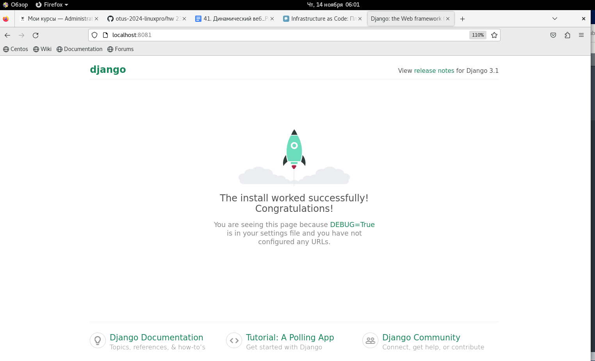
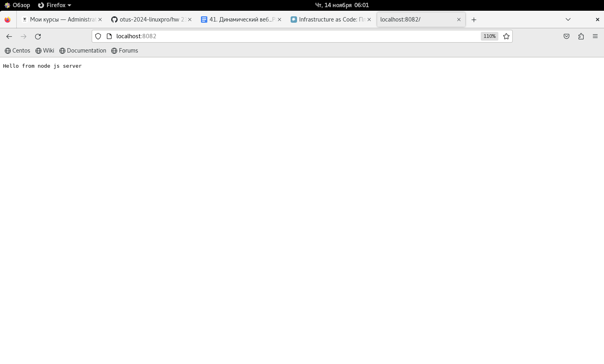
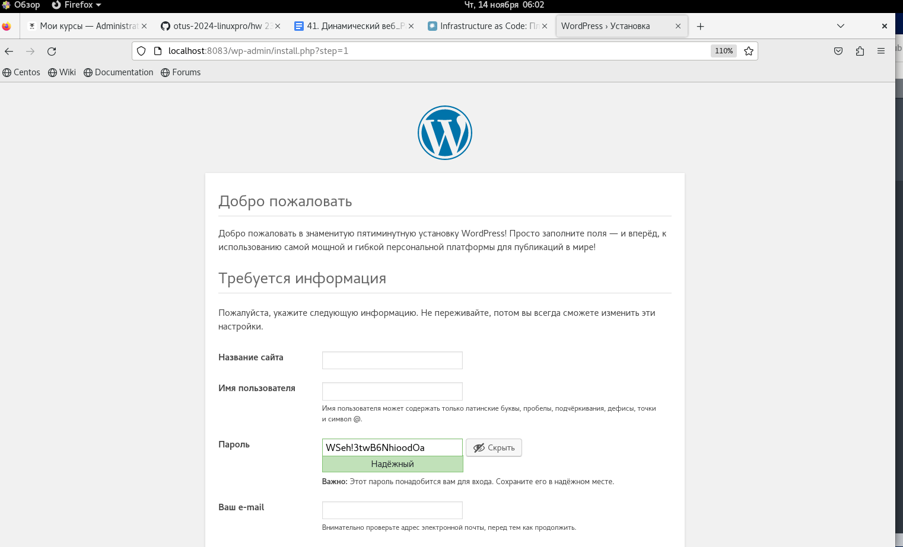

## Домашее задание № 26 Развертывание веб приложения

### 42. Динамический веб

#### Цель

Получить практические навыки в настройке инфраструктуры с помощью манифестов и конфигураций. Отточить навыки использования ansible/vagrant/docker.

#### Описание домашнего задания

В этом методическом указании мы рассмотрим вариант стенда nginx + php-fpm (wordpress) + python (django) + js(node.js) 
с деплоем через docker-compose

К сдаче принимается:
vagrant стэнд с проброшенными на локалхост портами
каждый порт на свой сайт
через нжинкс Формат сдачи ДЗ - vagrant + ansible

#### Ход работы

вариант стенда nginx + php-fpm (wordpress) + python (django) + js(node.js) 
с деплоем через docker-compose

#### Настройка окружения в docker-compose
Для развёртки wordpress необходима база данных, выберем postgres:

```
postgres:
    image: postgres:10.5
    container_name: postgres
    restart: always
    environment:
      - POSTGRES_DB=postgres
      - POSTGRES_USER=postgres
      - POSTGRES_PASSWORD=postgres
    ports:
      - '5432:5432'
    volumes:
      - ./postgres-data:/var/lib/postgresql/data
    networks:
      - app-network

```

Для того чтобы объединить наши приложения, создадим сеть и будем добавлять каждый контейнер в неё:

```
networks:
  app-network:
    driver: bridge
```

Добавим контейнеры wordpress, nginx, django, node.js.

```
wordpress:
    image: ntninja/wordpress-postgresql:latest # официальный образ от разработчиков
    container_name: wordpress
    restart: unless-stopped
# на странице образа в docker hub написано, какие можно задать переменные контейнеру https://hub.docker.com/_/wordpress
    environment:
      - WORDPRESS_DB_HOST=postgres
      - WORDPRESS_DB_NAME=postgres # Также импортируем переменные из .env
      - WORDPRESS_DB_USER=postgres
      - WORDPRESS_DB_PASSWORD=postgres
    volumes:
      - wordpress:/var/www/html # сохраняем приложение на хост машине
    networks:
      - app-network
    depends_on:
      - postgres # контейнер wordpress дождется запуска БД
```

nginx завсит от запуска контейнеров с приложениями:
```
nginx:
    image: nginx:1.15.12-alpine
    container_name: nginx
    restart: unless-stopped
# Т.к. все запросы к приложениям будут проходить через nginx, пробросим под каждое приложение по порту.
    ports:
      - 8083:8083
      - 8081:8081
      - 8082:8082
    volumes:
# будет использоваться php-fpm, необходимо смонтировать статические файлы wordpress :
      - wordpress:/var/www/html
      - ./nginx-conf:/etc/nginx/conf.d # монтируем конфиг
    networks:
      - app-network
    depends_on: # nginx будет запускаться после всех приложений
      - wordpress
      - app
      - node

```

Выполним настройку конфига nginx (согласно методичке)

Исходный код Django приложения (берем из методички)

Исходный код node.js приложения (берем из методички)

На этом настройка docker-compose закончена, приступим к написанию playbook (согласно методичке)
```
 hosts: DynamicWeb # имя хоста, который мы создадим Vagrant`om
  become: yes # Установка Docker через sudo
  gather_facts: false
  tasks: # Перечисляем задачи которые выполнит наш playbook
  - name: Install docker packages # устанавливаем пакеты необходимые для установки докера
    become: yes
    apt:
      name: "{{ item }}"
      state: present
      update_cache: yes
    with_items:
      - apt-transport-https
      - ca-certificates
      - curl
      - software-properties-common
    tags:
      - docker
....

```

Ну и соответственно Vagrantfile:
```
Vagrant.configure(2) do |config|

    config.vm.provision "ansible" do |ansible|
       ansible.playbook = "prov.yml"
     end
  
     config.vm.define "DynamicWeb" do |vmconfig| 
      vmconfig.vm.box = 'bento/ubuntu-20.04'
      vmconfig.vm.hostname = 'DynamicWeb'

      vmconfig.vm.network "forwarded_port", guest: 8083, host: 8083
      vmconfig.vm.network "forwarded_port", guest: 8081, host: 8081
      vmconfig.vm.network "forwarded_port", guest: 8082, host: 8082
      vmconfig.vm.provider "virtualbox" do |vbx|
       vbx.memory = "2048"
       vbx.cpus = "2"
       vbx.customize ["modifyvm", :id, '--audio', 'none']
      end
     end
  
  end
```

Структура проекта
.
├── project
│   ├── docker-compose.yml
│   ├── nginx-conf
│   │   └── nginx.conf
│   ├── node
│   │   └── test.js
│   ├── python
│       ├── Dockerfile
│       ├── manage.py
│       ├── mysite
│       │   ├── asgi.py
│       │   ├── __init__.py
│       │   ├── settings.py
│       │   ├── urls.py
│       │   └── wsgi.py
|       └── requirements.txt     
|──README.md
|
├── prov.yml
└── Vagrantfile

Проверка:

1) DJANGO


2) nodejs



3) Wordpress




