## Домашее задание № 7 Загрузка системы

### Занятие 10. Загрузка системы

#### Описание домашнего задания

Задание
1. Попасть в систему без пароля несколькими способами
2. Установить систему с LVM, после чего переименовать VG
3. Добавить модуль в initrd

#### Ход работы

##### Попасть в систему без пароля несколькими способами

Способ 1. init=/bin/sh

● В конце строки, начинающейся с linux16, добавляем init=/bin/sh и нажимаем сtrl-x для загрузки в систему

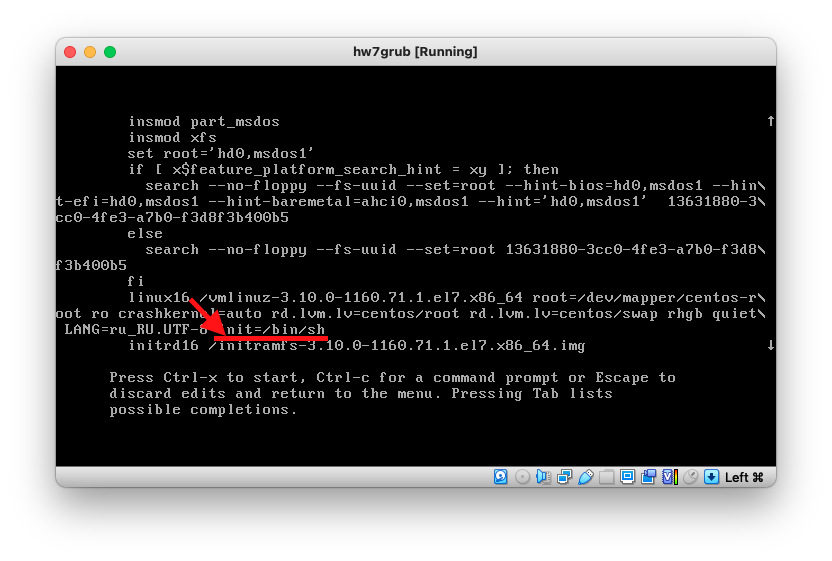

● В целом на этом все, Вы попали в систему. Но есть один нюанс. Рутовая файловая система при этом монтируется в режиме Read-Only. Если вы хотите перемонтировать ее в режим Read-Write, можно воспользоваться командой:

● После чего можно убедиться, записав данные в любой файл или прочитав вывод
команды:

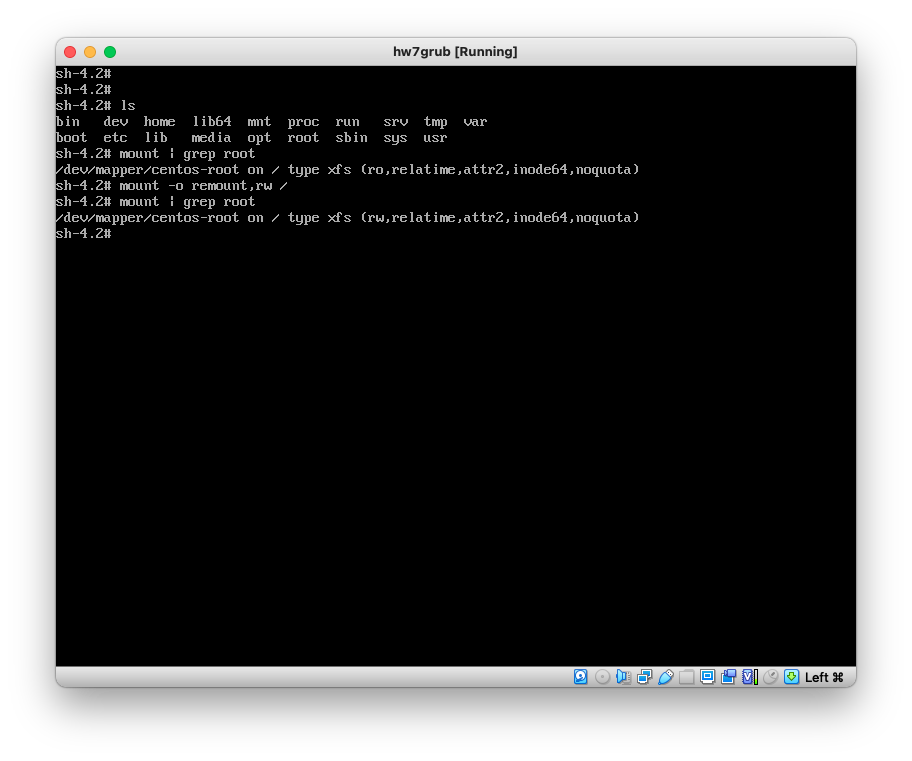

Способ 2. rd.break

● В конце строки, начинающейся с linux16, добавляем rd.break и нажимаем сtrl-x для загрузки в систему
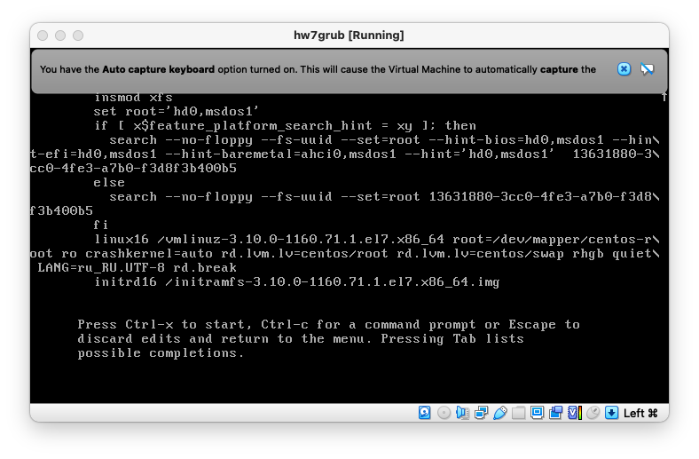

● Попадаем в emergency mode. Наша корневая файловая система смонтирована (опять же в режиме Read-Only, но мы не в ней). Далее будет пример, как попасть в нее и поменять пароль администратора:
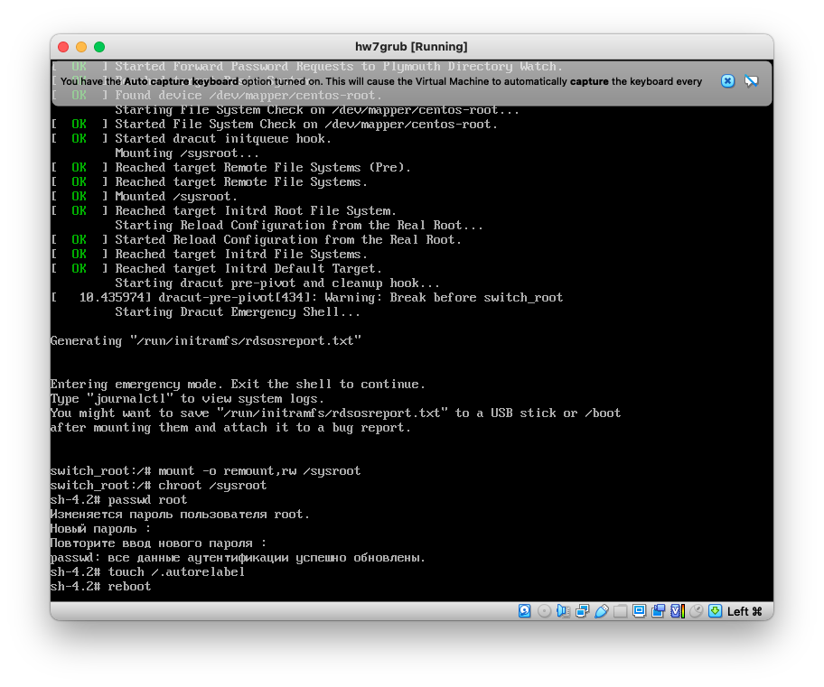

● После чего можно перезагружаться и заходить в систему с новым паролем. Полезно, когда вы потеряли или вообще не имели пароль администратор.
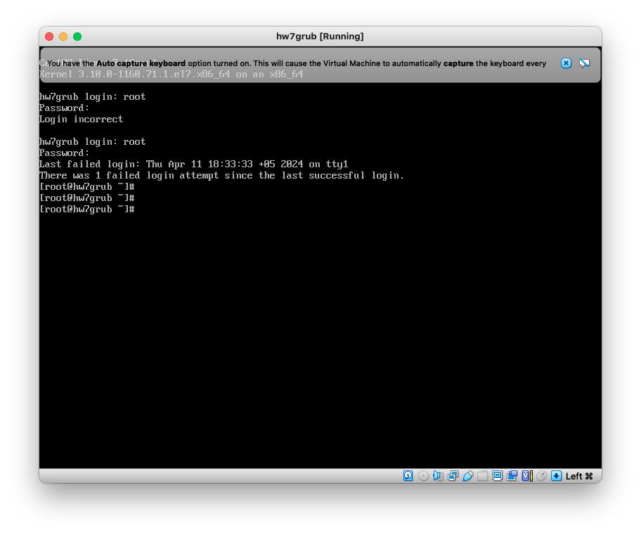

Способ 3. rw init=/sysroot/bin/sh

● В строке, начинающейся с linux16, заменяем ro на rw init=/sysroot/bin/sh и нажимаем сtrl-x для загрузки в систему
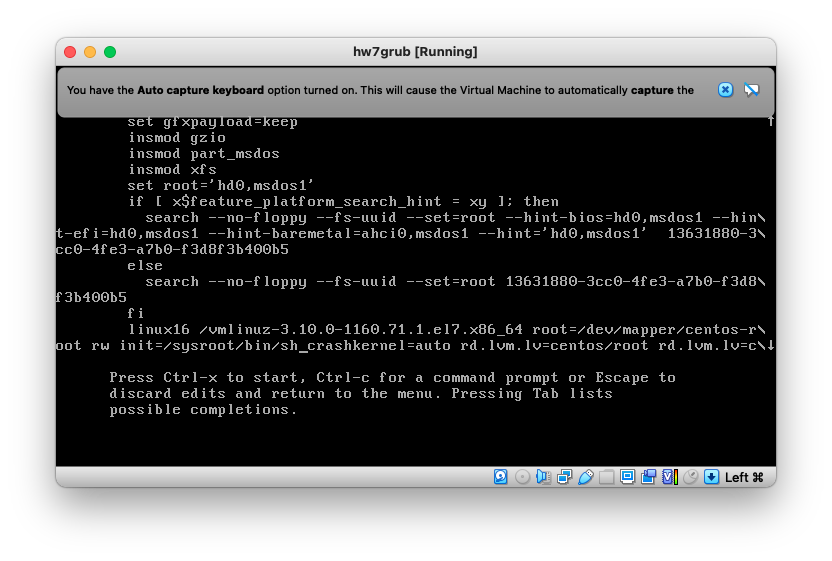

● В целом то же самое, что и в прошлом примере, но файловая система сразу смонтирована в режим Read-Write
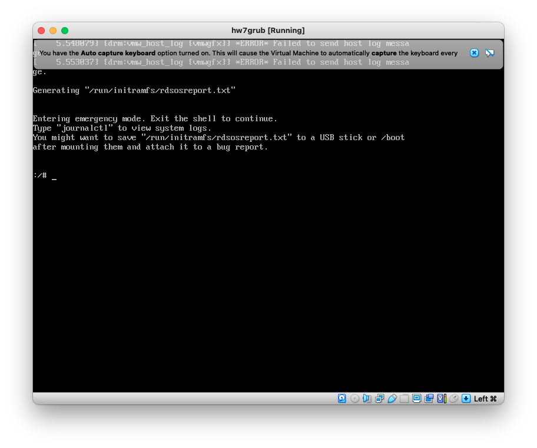

● В прошлых примерах тоже можно заменить ro на rw

##### Установить систему с LVM, после чего переименовать VG
● Первым делом посмотрим текущее состояние системы:
[root@otuslinux ~]# vgs
VG #PV #LV #SN Attr VSize VFree
centos1 2 0 wz--n- <38.97g 0

● Нас интересует вторая строка с именем Volume Group

● Приступим к переименованию:
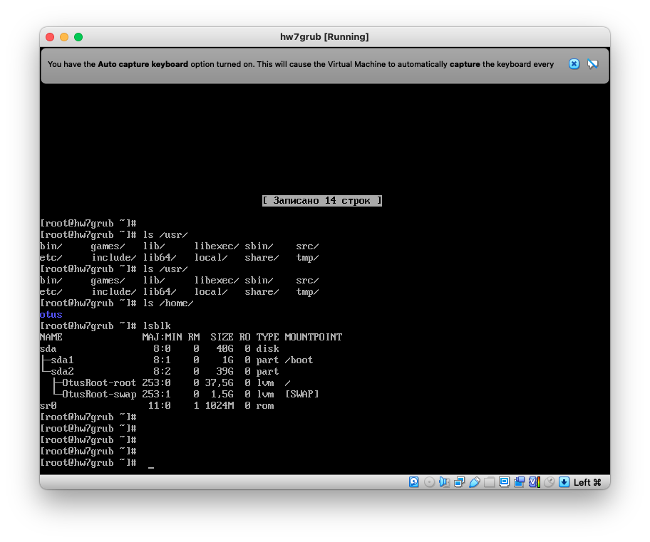

● Далее правим /etc/fstab, /etc/default/grub, /boot/grub2/grub.cfg. Везде заменяем старое название на новое. По ссылкам можно увидеть примеры получившихся файлов.
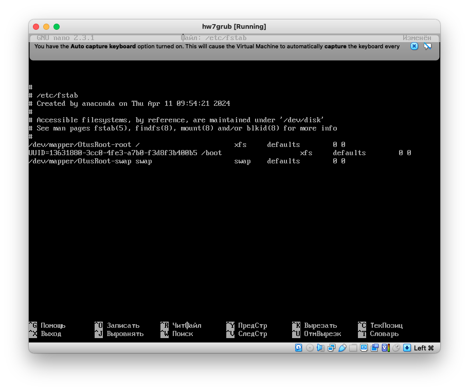

● Пересоздаем initrd image, чтобы он знал новое название Volume Group
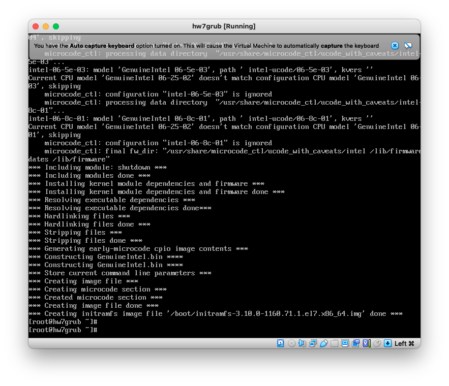

##### Добавить модуль в initrd

Скрипты модулей хранятся в каталоге /usr/lib/dracut/modules.d/. Для того, чтобы добавить свой модуль, создаем там папку с именем 01test:
В нее поместим два скрипта:

1. module-setup.sh - который устанавливает модуль и вызывает скрипт test.sh
2. test.sh - собственно сам вызываемый скрипт, в нём у нас рисуется пингвинчик

● Пересобираем образ initrd

mkinitrd -f -v /boot/initramfs-$(uname -r).img $(uname -r)

● Можно проверить/посмотреть, какие модули загружены в образ:
[root@hw7grub ~]# lsinitrd -m /boot/initramfs-$(uname -r).img | grep test
test
[root@hw7grub ~]# 

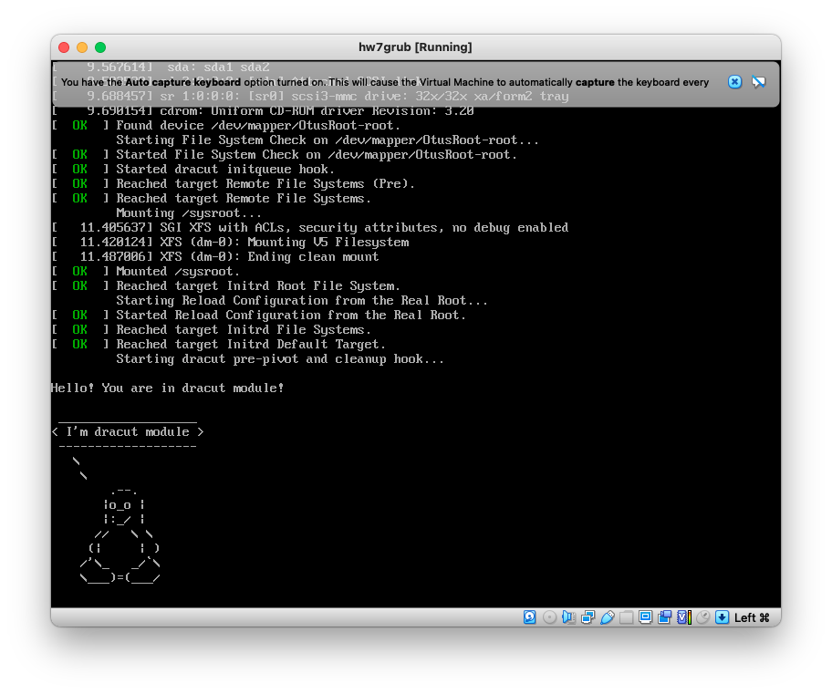
