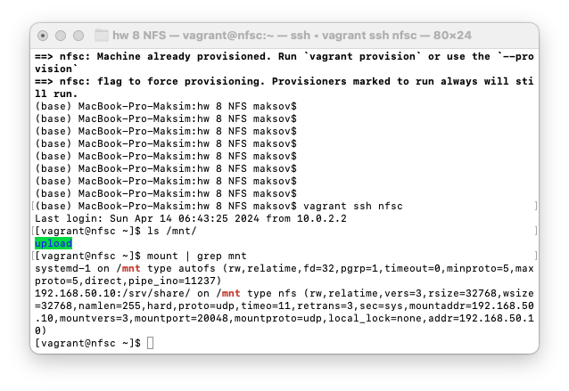
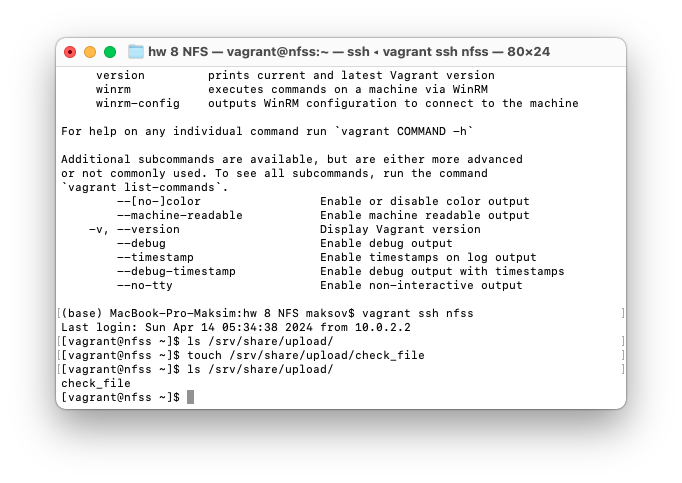
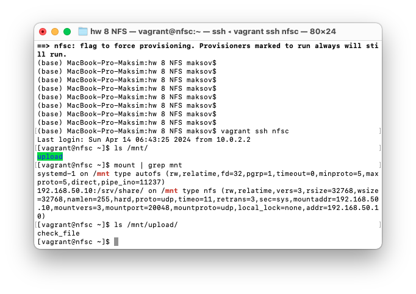

## Домашее задание № 8 NFS

### Занятие 11. NFS

#### Цель

- Научиться самостоятельно развернуть сервис NFS и подключить к нему клиента 

#### Описание домашнего задания

Основная часть: 
- `vagrant up` должен поднимать 2 настроенных виртуальных машины (сервер NFS и клиента) без дополнительных ручных действий; - на сервере NFS должна быть подготовлена и экспортирована директория; 
- в экспортированной директории должна быть поддиректория с именем __upload__ с правами на запись в неё; 
- экспортированная директория должна автоматически монтироваться на клиенте при старте виртуальной машины (systemd, autofs или fstab -  любым способом); 
- монтирование и работа NFS на клиенте должна быть организована с использованием NFSv3 по протоколу UDP; 
- firewall должен быть включен и настроен как на клиенте, так и на сервере. 


#### Ход работы

1. Написание Vagrantfile

Для реализации стенда используется клиент-серверная архитектура.
Для этого в стенде разворачивается 2 виртуальных машины(nfss(сервер) и nfsc(клиент)) с настроенной сетью.
```
nfss.vm.network "private_network", ip: "192.168.50.10",  virtualbox__intnet: "net1" 
nfsc.vm.network "private_network", ip: "192.168.50.11",  virtualbox__intnet: "net1" 
```
Также для виртуальных машин заданы SHELL Provisions, которые выполняют bash-скрипты при старте виртуальных машин.

```
nfss.vm.provision "shell", path: "nfss_script.sh"
nfsc.vm.provision "shell", path: "nfsc_script.sh"
```
Остальные параметры стандартны для Vagrantfile

2. Настройка сервера NFS
При старте виртуальной машины настриваем NFS сервер
- включаем firewall и настраиваем на работу портов NFS
- скачиваем nfs-utils
- включаем nfs и настриваем папку для шары, а также кто может подключаться к папке и с какими правами
```
# Creating dir and share

mkdir -p /srv/share/upload
chown -R nfsnobody:nfsnobody /srv/share
chmod 0777 /srv/share/upload

cat << EOF > /etc/exports 
/srv/share 192.168.50.11/32(rw,sync,root_squash)
EOF

exportfs -r 
```
3. Настраиваем клиента NFS
- включаем firewall
- скачиваем nfs-utils
- прописываем автомонтирование шары к серверу 192.168.50.10
```
echo "192.168.50.10:/srv/share/ /mnt nfs vers=3,proto=udp,noauto,x-systemd.automount 0 0" >> /etc/fstab
systemctl daemon-reload 
systemctl restart remote-fs.target
```
4. Проверка стенда
Проверяем подключение шары на клиенте:



Проверям работу шары. Создадим файл на сервере и проверим его отображение на клиенте:

Создание файла на сервере:



Отображение файла на клиенте:




