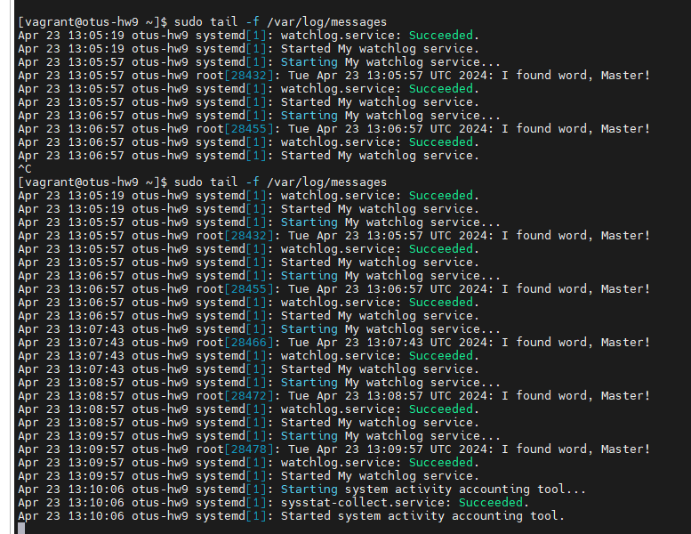
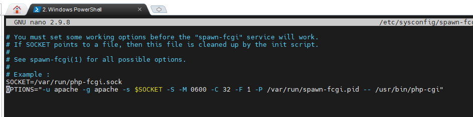
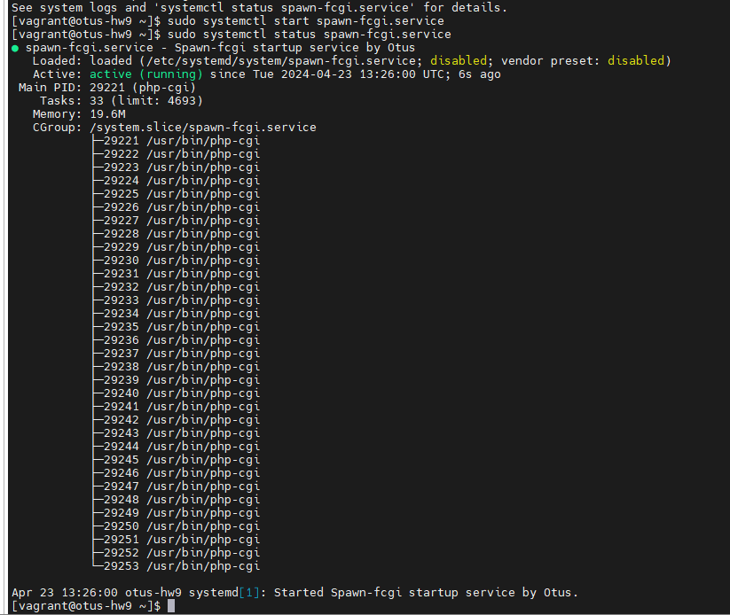
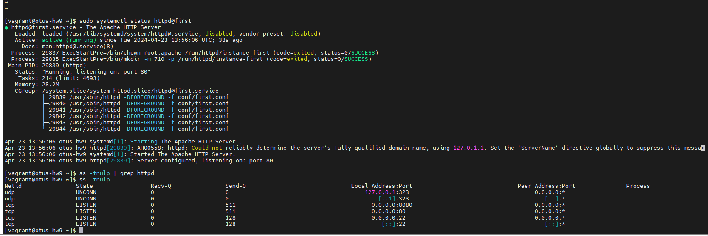

## Домашее задание № 9 Systemd

### Занятие 12. Systemd

#### Цель

- Научиться редактировать существующие и создавать новые unit-файлы;

#### Описание домашнего задания

Написать сервис, который будет раз в 30 секунд мониторить лог на предмет наличия ключевого слова. Файл и слово должны задаваться в /etc/sysconfig

#### Ход работы

#####  1. Написать service, который будет раз в 30 секунд мониторить лог на предмет наличия ключевого слова (файл лога и ключевое слово должны задаваться в /etc/sysconfig или в /etc/default).


Для начала создаём файл с конфигурацией для сервиса в директории /etc/sysconfig - из неё сервис будет брать необходимые переменные.


Создаем скрипт поиска слова в файле

```
#!/bin/bash

WORD=$1
LOG=$2
DATE=`date`

if grep $WORD $LOG &> /dev/null
then
logger "$DATE: I found word, Master!"
else
exit 0
fi


```

Создаем юниты: таймер и сервис

```
[Unit]
Description=My watchlog service

[Service]
Type=oneshot
EnvironmentFile=/etc/sysconfig/watchlog
ExecStart=/opt/watchlog.sh $WORD $LOG

```

```
[Unit]
Description=Run watchlog script every 30 second

[Timer]
# Run every 30 second
OnUnitActiveSec=30
Unit=watchlog.service

[Install]
WantedBy=multi-user.target

```

Запускаем таймер и сервис.

Проверяем


##### 2. Из epel установить spawn-fcgi и переписать init-скрипт на unit-файл. Имя сервиса должно также называться.

Устанавливаем spawn-fcgi и необходимые для него пакеты:
yum install epel-release -y && yum install spawn-fcgi php php-cli mod_fcgid httpd -y

Правим конф файл cat /etc/sysconfig/spawn-fcgi

Переписываем Юнит
```
 cat /etc/systemd/system/spawn-fcgi.service
[Unit]
Description=Spawn-fcgi startup service by Otus
After=network.target

[Service]
Type=simple
PIDFile=/var/run/spawn-fcgi.pid
EnvironmentFile=/etc/sysconfig/spawn-fcgi
ExecStart=/usr/bin/spawn-fcgi -n $OPTIONS
KillMode=process

[Install]
WantedBy=multi-user.target
```
Проверяем работоспособность


##### 3. Дополнить юнит-файл apache httpd возможностью запустить несколько инстансов сервера с разными конфигами

Для запуска нескольких экземпляров сервиса будем использовать шаблон в
конфигурации файла окружения (/usr/lib/systemd/system/httpd.service ):
```
[Unit]
Description=The Apache HTTP Server
Wants=httpd-init.service

After=network.target remote-fs.target nss-lookup.target httpd-
init.service

Documentation=man:httpd.service(8)

[Service]
Type=notify
Environment=LANG=C
EnvironmentFile=/etc/sysconfig/httpd-%I
ExecStart=/usr/sbin/httpd $OPTIONS -DFOREGROUND
ExecReload=/usr/sbin/httpd $OPTIONS -k graceful
# Send SIGWINCH for graceful stop
KillSignal=SIGWINCH
KillMode=mixed
PrivateTmp=true

[Install]
WantedBy=multi-user.target
```

В самом файле окружения (которых будет два) задается опция для запуска веб-сервера с необходимым конфигурационным файлом:
```
# /etc/sysconfig/httpd-first
OPTIONS=-f conf/first.conf

# /etc/sysconfig/httpd-second
OPTIONS=-f conf/second.conf
```
Соответственно в директории с конфигами httpd (/etc/httpd/conf) должны лежать два конфига, в нашем случае это будут first.conf и second.conf
Для удачного запуска, в конфигурационных файлах должны быть указаны уникальные для каждого экземпляра опции Listen и PidFile. Конфиги можно скопировать и поправить только второй, в нем должны быть след. опции:
```
PidFile /var/run/httpd-second.pid
Listen 8080
```
Этого достаточно для успешного запуска.



